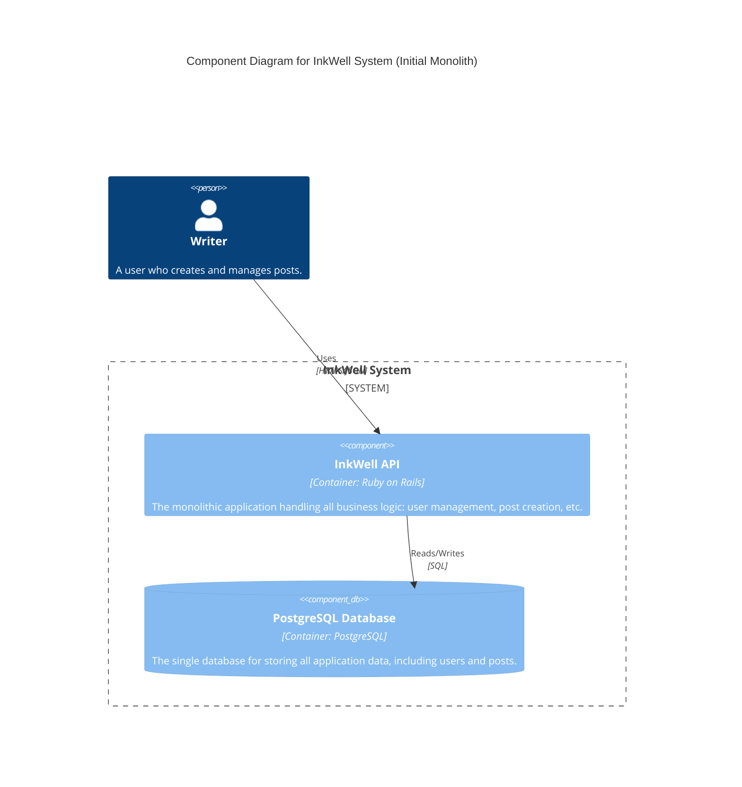
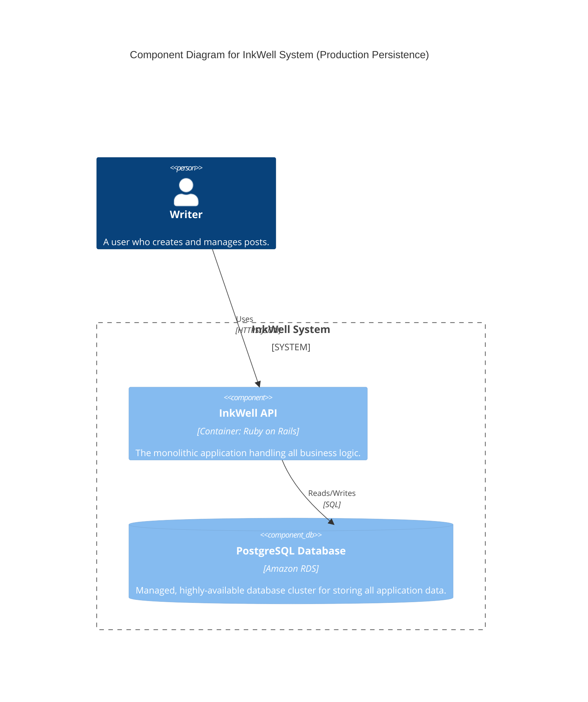
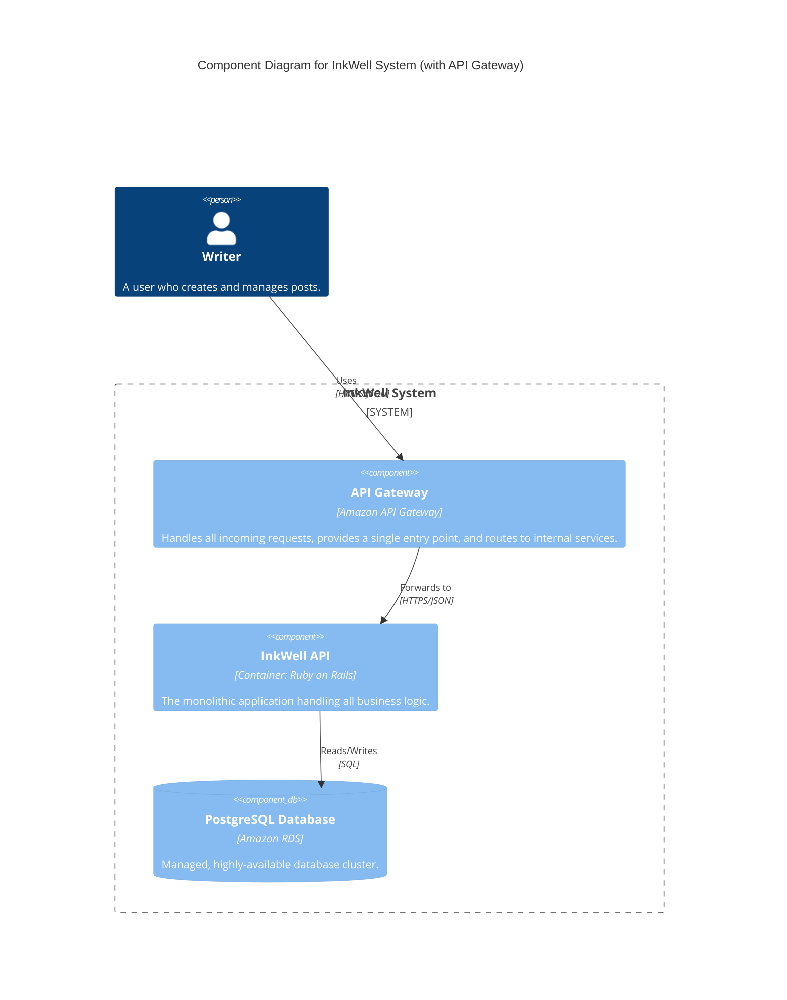
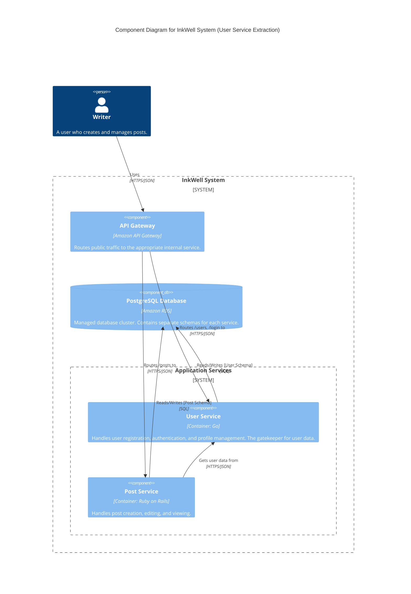
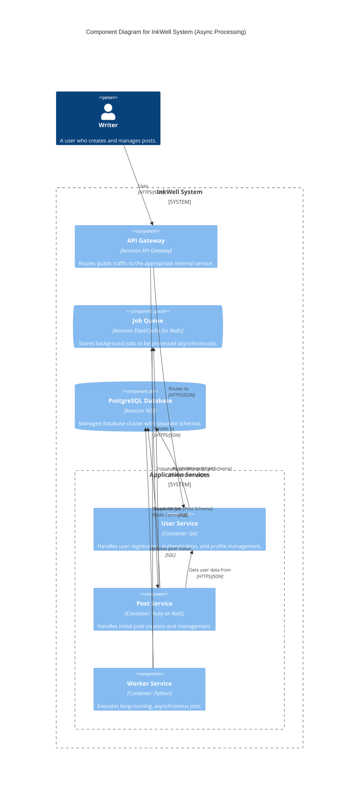
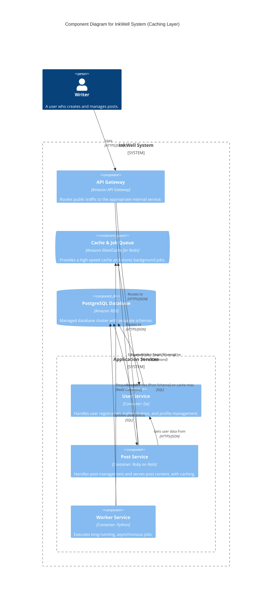
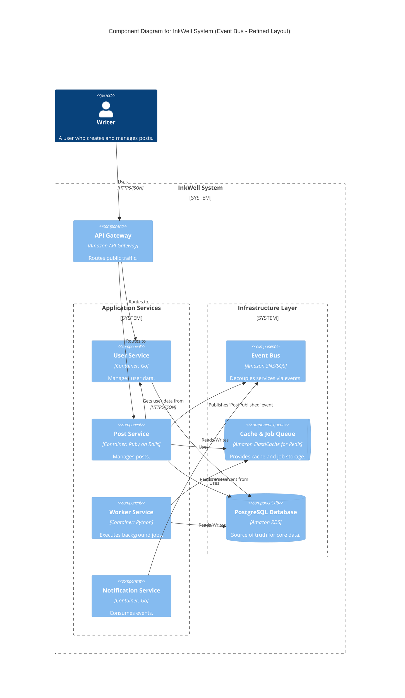
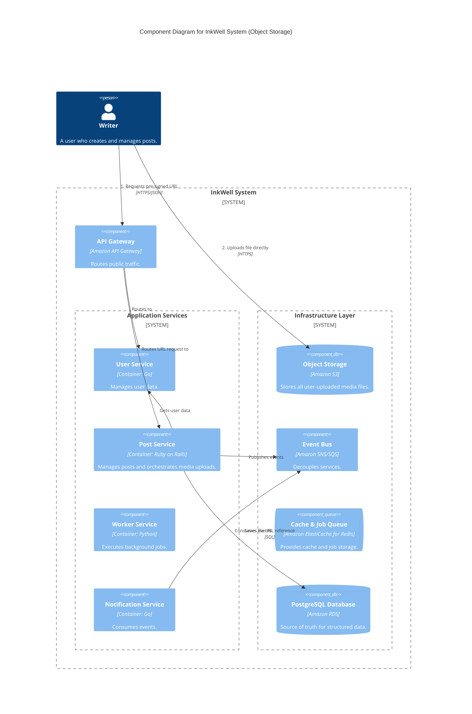
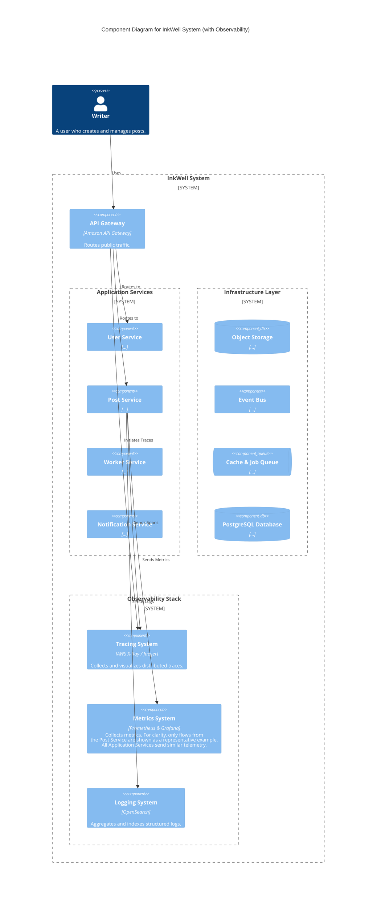
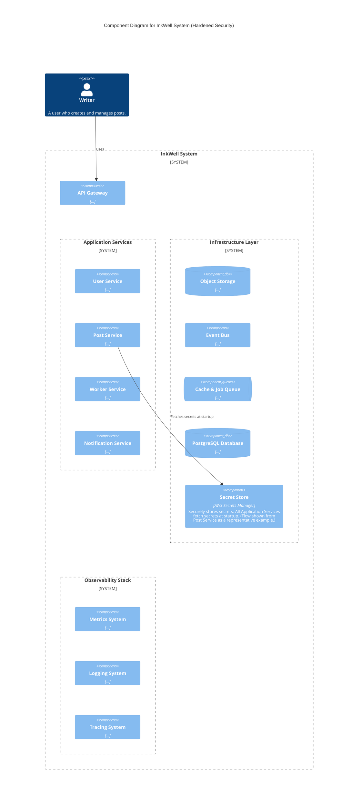

### The Architectural Evolution of the InkWell Platform

This document presents the logical evolution of the InkWell platform's architecture. Following the Issue-Driven Architecture-as-Code (AaC) process, the system grew from a simple monolith to a comprehensive, decoupled, and production-ready microservices architecture. Each of the following C4 Component diagrams represents the state of the logical architecture after a specific architectural issue was addressed and "merged."

---

#### **Stage 1: Initial Monolithic Service**

This is the baseline architecture, designed to be the simplest possible system that delivers core value. It establishes the foundational components and their primary relationships.

*   **Key Architectural Elements:**
    *   The **Writer** is the user (Person) who interacts with the system.
    *   A single **InkWell API** component (the monolith) contains all business logic for user management and post creation.
    *   A single **PostgreSQL Database** component stores all application data in one place.
    *   The data flow is simple: the Writer uses the API, and the API reads from and writes to the database.

---

#### **Stage 2: Production-Grade Persistence**

This stage addresses the need for a reliable and scalable database, a critical step towards production readiness. While this is primarily a physical change, it is reflected in the logical diagram through updated component descriptions to communicate the new, robust nature of our data store.

*   **Key Architectural Changes:**
    *   The **PostgreSQL Database** component's technology is now specified as "Amazon RDS."
    *   Its description is updated to reflect that it is a "managed, highly-available database cluster," signaling a significant increase in reliability from the original containerized version.

---

#### **Stage 3: Secure Entry Point with API Gateway**

To secure the system and create a managed entry point, an API Gateway is introduced. This is a fundamental change to how clients interact with the system.

*   **Key Architectural Changes:**
    *   A new **API Gateway** component is added.
    *   The primary data flow is rerouted: the **Writer** now interacts directly with the **API Gateway**, not the InkWell API.
    *   The API Gateway is now responsible for forwarding valid requests to the internal **InkWell API**.

---

#### **Stage 4: Externalize User Management (First Decomposition)**

This is the first major step in decomposing the monolith, applying the "Principle of State Encapsulation." User management is extracted into its own dedicated service.

*   **Key Architectural Changes:**
    *   The original monolith is renamed to **Post Service**.
    *   A new **User Service** component is introduced. It is now the official "gatekeeper" for all user data.
    *   The **API Gateway** now performs routing, sending user-related traffic to the User Service and post-related traffic to the Post Service.
    *   A new inter-service dependency is created: the **Post Service** must now make an API call to the **User Service** to get user data.

---

#### **Stage 5: Implement Asynchronous Post Processing**

To improve user-facing performance, slow operations are moved to the background. This introduces our first asynchronous workflow.

*   **Key Architectural Changes:**
    *   A **Job Queue** component is added to hold tasks that can be processed later.
    *   A new **Worker Service** is introduced, whose sole responsibility is to process jobs from the queue.
    *   The **Post Service** no longer performs slow tasks synchronously. Instead, it enqueues a job in the **Job Queue** and returns an immediate response to the user.

---

#### **Stage 6: Introduce a Caching Layer**

To reduce read load on the database and improve latency for popular content, a caching layer is implemented.

*   **Key Architectural Changes:**
    *   The **Job Queue** component is updated to become a dual-purpose **Cache & Job Queue**, reflecting its new responsibility.
    *   A new relationship is added: the **Post Service** now attempts to read data from the **Cache & Job Queue** first.
    *   The relationship from the Post Service to the database is now conditional, described as being "on cache miss."

---

#### **Stage 7: Decouple Notifications with an Event Bus**

To create a more scalable and resilient system, notifications are fully decoupled from the post creation process using a "fire-and-forget" event pattern.

*   **Key Architectural Changes:**
    *   A central **Event Bus** component is introduced for pub/sub messaging.
    *   A new **Notification Service** is added as an event consumer.
    *   The **Post Service** no longer knows about notifications; it simply publishes a `PostPublished` event to the **Event Bus**.
    *   The **Notification Service** independently consumes this event and handles the notification logic.

---

#### **Stage 8: Add Object Storage for User-Uploaded Media**

To handle large file uploads in a scalable and cost-effective way, a dedicated object storage service is integrated using a "pre-signed URL" pattern.

*   **Key Architectural Changes:**
    *   An **Object Storage** component is added to the infrastructure layer.
    *   The upload workflow is now a two-step process, shown clearly in the diagram's relationships:
        1.  The **Writer** first requests a secure upload URL from the **Post Service**.
        2.  The **Writer** then uses that URL to upload the file **directly** to the **Object Storage** component, offloading the bandwidth from our application servers.

---

#### **Stage 9: Implement Comprehensive Observability Stack**

To operate the increasingly complex distributed system effectively, a dedicated observability stack is introduced as a cross-cutting concern.

*   **Key Architectural Changes:**
    *   A new **Observability Stack** boundary is added, containing three new components: **Metrics System**, **Logging System**, and **Tracing System**.
    *   To maintain clarity, the diagram uses a "representative example" pattern. Telemetry flows are shown from the **Post Service** to the stack.
    *   The component descriptions clarify that this pattern applies to all services in the "Application Services" layer.

---

#### **Stage 10: Harden Security and Externalize Configuration**

In the final step of our initial roadmap, we introduce a dedicated secret management system to complete our production-readiness posture.

*   **Key Architectural Changes:**
    *   A **Secret Store** component is added to the infrastructure layer.
    *   Following the "representative example" pattern, a relationship is shown from the **Post Service** to the **Secret Store**, representing that the service fetches its credentials at startup.
    *   The component's description clarifies that all application services follow this pattern, ensuring a secure and centrally-managed approach to secrets.

