### The Architectural Evolution of the InkWell Platform

This document presents the logical evolution of the InkWell platform's architecture. Following the Issue-Driven Architecture-as-Code (AaC) process, the system grew from a simple monolith to a comprehensive, decoupled, and production-ready microservices architecture. Each of the following C4 Component diagrams represents the state of the logical architecture after a specific architectural issue was addressed and "merged."

---

#### **Milestone 1: Initial Monolithic Service**

This is the baseline architecture, designed to be the simplest possible system that delivers core value. It establishes the foundational components and their primary relationships.

*   **Key Architectural Elements:**
    *   The **Writer** is the user (Person) who interacts with the system.
    *   A single **InkWell API** component (the monolith) contains all business logic for user management and post creation.
    *   A single **PostgreSQL Database** component stores all application data in one place.
    *   The data flow is simple: the Writer uses the API, and the API reads from and writes to the database.

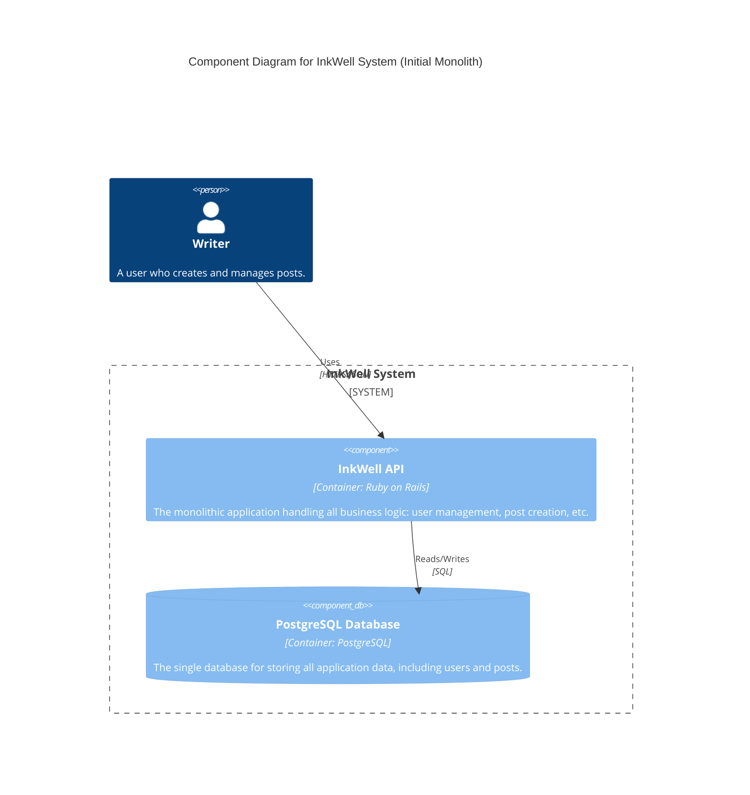
```mermaid
C4Component
    title Component Diagram for InkWell System (Initial Monolith)

    Person(writer, "Writer", "A user who creates and manages posts.")

    System_Boundary(c1, "InkWell System") {
        Component(monolith, "InkWell API", "Container: Ruby on Rails", "The monolithic application handling all business logic: user management, post creation, etc.")
        ComponentDb(db, "PostgreSQL Database", "Container: PostgreSQL", "The single database for storing all application data, including users and posts.")
    }

    Rel(writer, monolith, "Uses", "HTTPS/JSON")
    Rel(monolith, db, "Reads/Writes", "SQL")
```

---

#### **Milestone 2: Production-Grade Persistence**

This milestone addresses the need for a reliable and scalable database, a critical step towards production readiness. While this is primarily a physical change, it is reflected in the logical diagram through updated component descriptions to communicate the new, robust nature of our data store.

*   **Key Architectural Changes:**
    *   The **PostgreSQL Database** component's technology is now specified as "Amazon RDS."
    *   Its description is updated to reflect that it is a "managed, highly-available database cluster," signaling a significant increase in reliability from the original containerized version.

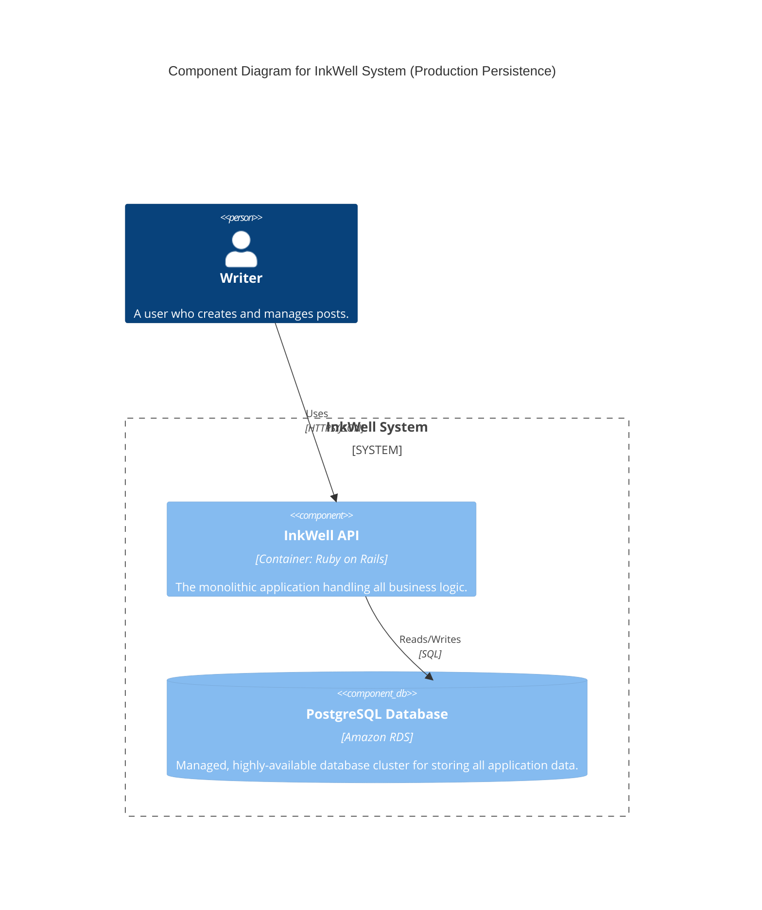
```mermaid
C4Component
    title Component Diagram for InkWell System (Production Persistence)

    Person(writer, "Writer", "A user who creates and manages posts.")

    System_Boundary(c1, "InkWell System") {
        Component(monolith, "InkWell API", "Container: Ruby on Rails", "The monolithic application handling all business logic.")
        ComponentDb(db, "PostgreSQL Database", "Amazon RDS", "Managed, highly-available database cluster for storing all application data.")
    }

    Rel(writer, monolith, "Uses", "HTTPS/JSON")
    Rel(monolith, db, "Reads/Writes", "SQL")
```

---

#### **Milestone 3: Secure Entry Point with API Gateway**

To secure the system and create a managed entry point, an API Gateway is introduced. This is a fundamental change to how clients interact with the system.

*   **Key Architectural Changes:**
    *   A new **API Gateway** component is added.
    *   The primary data flow is rerouted: the **Writer** now interacts directly with the **API Gateway**, not the InkWell API.
    *   The API Gateway is now responsible for forwarding valid requests to the internal **InkWell API**.

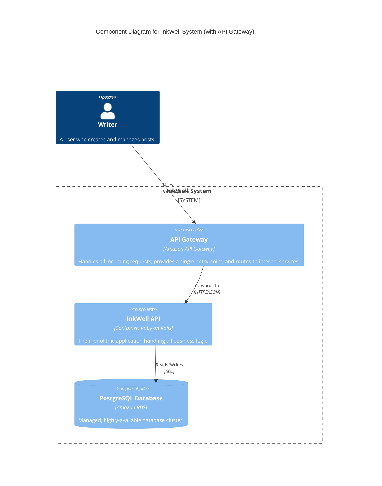
```mermaid
C4Component
    title Component Diagram for InkWell System (with API Gateway)

    Person(writer, "Writer", "A user who creates and manages posts.")

    System_Boundary(c1, "InkWell System") {
        Component(gateway, "API Gateway", "Amazon API Gateway", "Handles all incoming requests, provides a single entry point, and routes to internal services.")
        Component(monolith, "InkWell API", "Container: Ruby on Rails", "The monolithic application handling all business logic.")
        ComponentDb(db, "PostgreSQL Database", "Amazon RDS", "Managed, highly-available database cluster.")
    }

    Rel(writer, gateway, "Uses", "HTTPS/JSON")
    Rel(gateway, monolith, "Forwards to", "HTTPS/JSON")
    Rel(monolith, db, "Reads/Writes", "SQL")
```

---

#### **Milestone 4: Externalize User Management (First Decomposition)**

This is the first major step in decomposing the monolith, applying the "Principle of State Encapsulation." User management is extracted into its own dedicated service.

*   **Key Architectural Changes:**
    *   The original monolith is renamed to **Post Service**.
    *   A new **User Service** component is introduced. It is now the official "gatekeeper" for all user data.
    *   The **API Gateway** now performs routing, sending user-related traffic to the User Service and post-related traffic to the Post Service.
    *   A new inter-service dependency is created: the **Post Service** must now make an API call to the **User Service** to get user data.

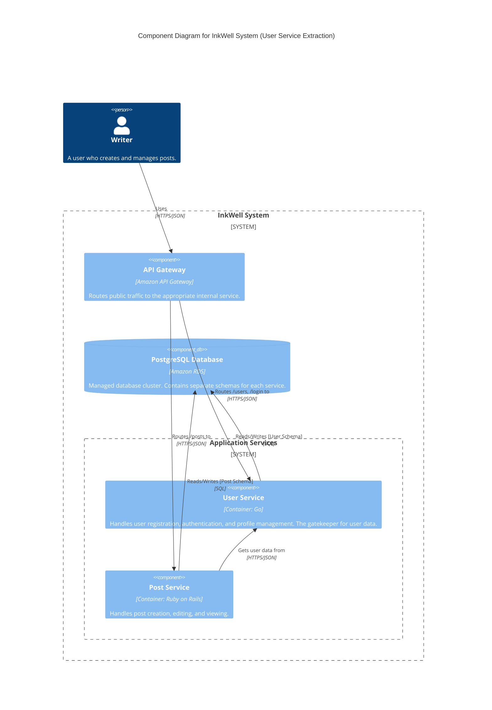
```mermaid
C4Component
    title Component Diagram for InkWell System (User Service Extraction)

    Person(writer, "Writer", "A user who creates and manages posts.")

    System_Boundary(c1, "InkWell System") {
        Component(gateway, "API Gateway", "Amazon API Gateway", "Routes public traffic to the appropriate internal service.")
        
        System_Boundary(c2, "Application Services") {
            Component(userService, "User Service", "Container: Go", "Handles user registration, authentication, and profile management. The gatekeeper for user data.")
            Component(postService, "Post Service", "Container: Ruby on Rails", "Handles post creation, editing, and viewing.")
        }

        ComponentDb(db, "PostgreSQL Database", "Amazon RDS", "Managed database cluster. Contains separate schemas for each service.")
    }

    Rel(writer, gateway, "Uses", "HTTPS/JSON")

    Rel_Down(gateway, userService, "Routes /users, /login to", "HTTPS/JSON")
    Rel_Down(gateway, postService, "Routes /posts to", "HTTPS/JSON")

    Rel(postService, userService, "Gets user data from", "HTTPS/JSON")

    Rel(userService, db, "Reads/Writes [User Schema]", "SQL")
    Rel(postService, db, "Reads/Writes [Post Schema]", "SQL")
```

---

#### **Milestone 5: Implement Asynchronous Post Processing**

To improve user-facing performance, slow operations are moved to the background. This introduces our first asynchronous workflow.

*   **Key Architectural Changes:**
    *   A **Job Queue** component is added to hold tasks that can be processed later.
    *   A new **Worker Service** is introduced, whose sole responsibility is to process jobs from the queue.
    *   The **Post Service** no longer performs slow tasks synchronously. Instead, it enqueues a job in the **Job Queue** and returns an immediate response to the user.

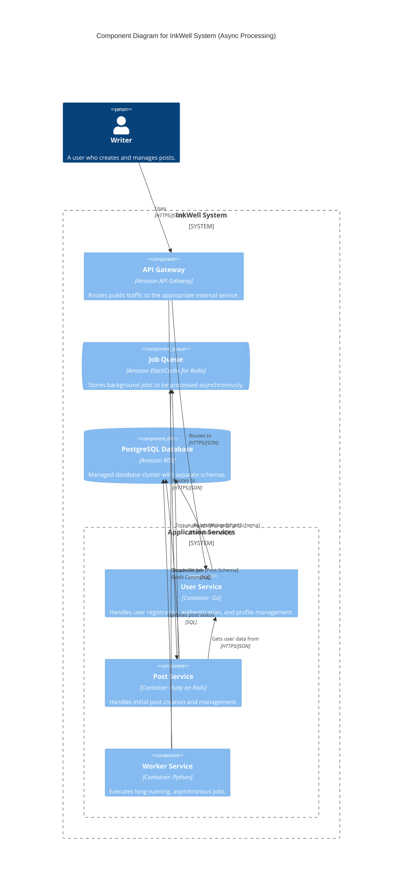
```mermaid
C4Component
    title Component Diagram for InkWell System (Async Processing)

    Person(writer, "Writer", "A user who creates and manages posts.")

    System_Boundary(c1, "InkWell System") {
        Component(gateway, "API Gateway", "Amazon API Gateway", "Routes public traffic to the appropriate internal service.")
        
        System_Boundary(c2, "Application Services") {
            Component(userService, "User Service", "Container: Go", "Handles user registration, authentication, and profile management.")
            Component(postService, "Post Service", "Container: Ruby on Rails", "Handles initial post creation and management.")
            Component(workerService, "Worker Service", "Container: Python", "Executes long-running, asynchronous jobs.")
        }

        ComponentQueue(queue, "Job Queue", "Amazon ElastiCache for Redis", "Stores background jobs to be processed asynchronously.")
        ComponentDb(db, "PostgreSQL Database", "Amazon RDS", "Managed database cluster with separate schemas.")
    }

    Rel(writer, gateway, "Uses", "HTTPS/JSON")

    Rel_Down(gateway, userService, "Routes to", "HTTPS/JSON")
    Rel_Down(gateway, postService, "Routes to", "HTTPS/JSON")

    Rel(postService, userService, "Gets user data from", "HTTPS/JSON")

    Rel(postService, queue, "Enqueues 'process-post' job", "Redis Command")
    Rel(workerService, queue, "Dequeues job", "Redis Command")
    
    Rel(workerService, db, "Updates post status", "SQL")
    Rel(userService, db, "Reads/Writes [User Schema]", "SQL")
    Rel(postService, db, "Reads/Writes [Post Schema]", "SQL")
```

---

#### **Milestone 6: Introduce a Caching Layer**

To reduce read load on the database and improve latency for popular content, a caching layer is implemented.

*   **Key Architectural Changes:**
    *   The **Job Queue** component is updated to become a dual-purpose **Cache & Job Queue**, reflecting its new responsibility.
    *   A new relationship is added: the **Post Service** now attempts to read data from the **Cache & Job Queue** first.
    *   The relationship from the Post Service to the database is now conditional, described as being "on cache miss."

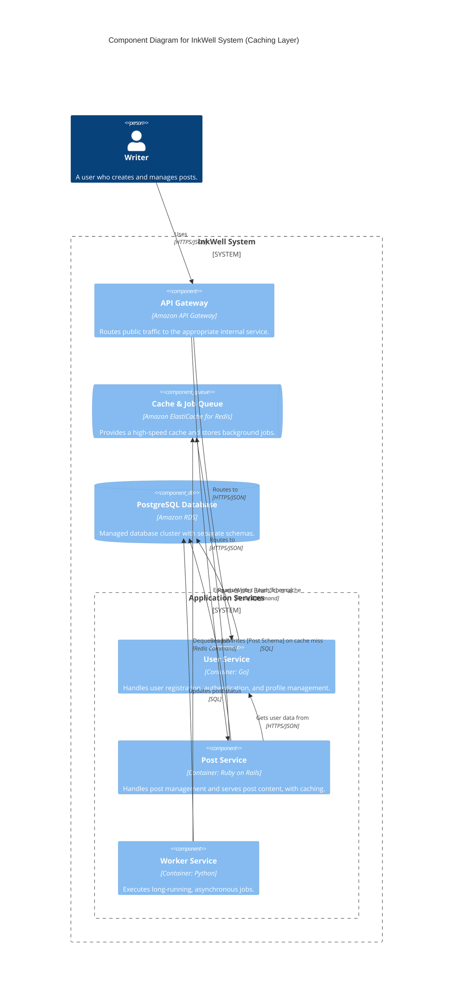
```mermaid
C4Component
    title Component Diagram for InkWell System (Caching Layer)

    Person(writer, "Writer", "A user who creates and manages posts.")

    System_Boundary(c1, "InkWell System") {
        Component(gateway, "API Gateway", "Amazon API Gateway", "Routes public traffic to the appropriate internal service.")
        
        System_Boundary(c2, "Application Services") {
            Component(userService, "User Service", "Container: Go", "Handles user registration, authentication, and profile management.")
            Component(postService, "Post Service", "Container: Ruby on Rails", "Handles post management and serves post content, with caching.")
            Component(workerService, "Worker Service", "Container: Python", "Executes long-running, asynchronous jobs.")
        }

        ComponentQueue(cacheQueue, "Cache & Job Queue", "Amazon ElastiCache for Redis", "Provides a high-speed cache and stores background jobs.")
        ComponentDb(db, "PostgreSQL Database", "Amazon RDS", "Managed database cluster with separate schemas.")
    }

    Rel(writer, gateway, "Uses", "HTTPS/JSON")

    Rel_Down(gateway, userService, "Routes to", "HTTPS/JSON")
    Rel_Down(gateway, postService, "Routes to", "HTTPS/JSON")

    Rel(postService, userService, "Gets user data from", "HTTPS/JSON")

    Rel(postService, cacheQueue, "Enqueues job / Reads from cache", "Redis Command")
    Rel(workerService, cacheQueue, "Dequeues job", "Redis Command")
    
    Rel(workerService, db, "Updates post status", "SQL")
    Rel(userService, db, "Reads/Writes [User Schema]", "SQL")
    Rel(postService, db, "Reads/Writes [Post Schema] on cache miss", "SQL")
```

---

#### **Milestone 7: Decouple Notifications with an Event Bus**

To create a more scalable and resilient system, notifications are fully decoupled from the post creation process using a "fire-and-forget" event pattern.

*   **Key Architectural Changes:**
    *   A central **Event Bus** component is introduced for pub/sub messaging.
    *   A new **Notification Service** is added as an event consumer.
    *   The **Post Service** no longer knows about notifications; it simply publishes a `PostPublished` event to the **Event Bus**.
    *   The **Notification Service** independently consumes this event and handles the notification logic.

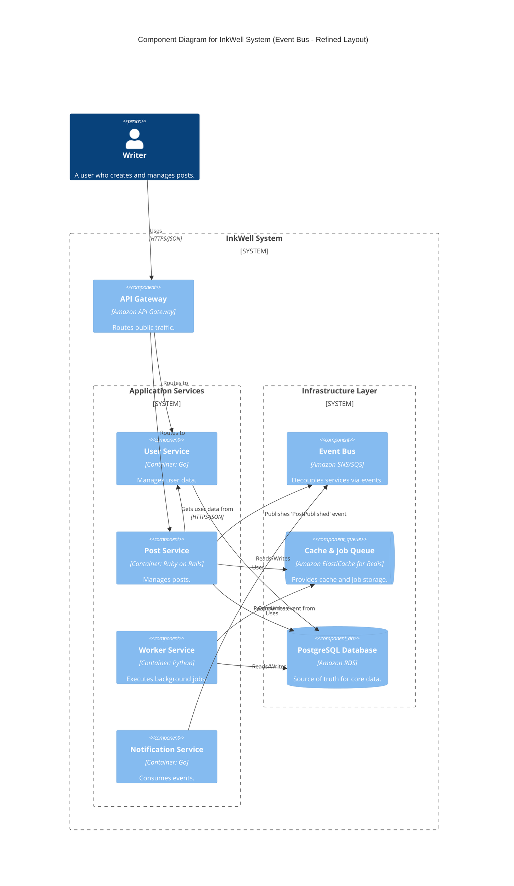
```mermaid
C4Component
    title Component Diagram for InkWell System (Event Bus - Refined Layout)

    Person(writer, "Writer", "A user who creates and manages posts.")

    System_Boundary(c1, "InkWell System") {
        Component(gateway, "API Gateway", "Amazon API Gateway", "Routes public traffic.")
        
        System_Boundary(c2, "Application Services") {
            Component(userService, "User Service", "Container: Go", "Manages user data.")
            Component(postService, "Post Service", "Container: Ruby on Rails", "Manages posts.")
            Component(workerService, "Worker Service", "Container: Python", "Executes background jobs.")
            Component(notificationService, "Notification Service", "Container: Go", "Consumes events.")
        }
        
        System_Boundary(c3, "Infrastructure Layer") {
             Component(eventBus, "Event Bus", "Amazon SNS/SQS", "Decouples services via events.")
             ComponentQueue(cacheQueue, "Cache & Job Queue", "Amazon ElastiCache for Redis", "Provides cache and job storage.")
             ComponentDb(db, "PostgreSQL Database", "Amazon RDS", "Source of truth for core data.")
        }
    }

    %% Relationships from User and Gateway
    Rel(writer, gateway, "Uses", "HTTPS/JSON")
    Rel_Down(gateway, postService, "Routes to")
    Rel_Down(gateway, userService, "Routes to")

    %% Inter-service communication
    Rel(postService, userService, "Gets user data from", "HTTPS/JSON")

    %% Relationships to Infrastructure
    Rel_Down(postService, eventBus, "Publishes 'PostPublished' event")
    Rel_Down(notificationService, eventBus, "Consumes event from")
    
    Rel_Down(postService, cacheQueue, "Uses")
    Rel_Down(workerService, cacheQueue, "Uses")
    
    Rel_Down(userService, db, "Reads/Writes")
    Rel_Down(postService, db, "Reads/Writes")
    Rel_Down(workerService, db, "Reads/Writes")
```

---

#### **Milestone 8: Add Object Storage for User-Uploaded Media**

To handle large file uploads in a scalable and cost-effective way, a dedicated object storage service is integrated using a "pre-signed URL" pattern.

*   **Key Architectural Changes:**
    *   An **Object Storage** component is added to the infrastructure layer.
    *   The upload workflow is now a two-step process, shown clearly in the diagram's relationships:
        1.  The **Writer** first requests a secure upload URL from the **Post Service**.
        2.  The **Writer** then uses that URL to upload the file **directly** to the **Object Storage** component, offloading the bandwidth from our application servers.

---

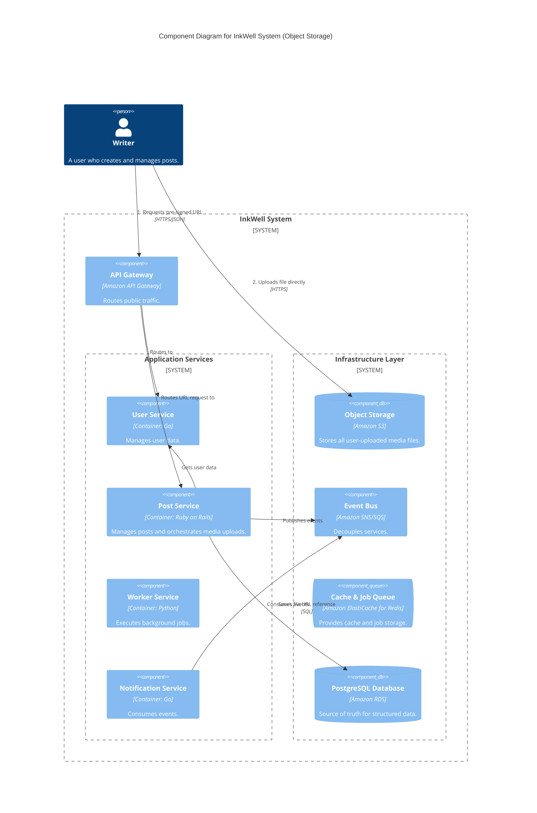
```mermaid
C4Component
    title Component Diagram for InkWell System (Object Storage)

    Person(writer, "Writer", "A user who creates and manages posts.")

    System_Boundary(c1, "InkWell System") {
        Component(gateway, "API Gateway", "Amazon API Gateway", "Routes public traffic.")
        
        System_Boundary(c2, "Application Services") {
            Component(userService, "User Service", "Container: Go", "Manages user data.")
            Component(postService, "Post Service", "Container: Ruby on Rails", "Manages posts and orchestrates media uploads.")
            Component(workerService, "Worker Service", "Container: Python", "Executes background jobs.")
            Component(notificationService, "Notification Service", "Container: Go", "Consumes events.")
        }
        
        System_Boundary(c3, "Infrastructure Layer") {
             ComponentDb(storage, "Object Storage", "Amazon S3", "Stores all user-uploaded media files.")
             Component(eventBus, "Event Bus", "Amazon SNS/SQS", "Decouples services.")
             ComponentQueue(cacheQueue, "Cache & Job Queue", "Amazon ElastiCache for Redis", "Provides cache and job storage.")
             ComponentDb(db, "PostgreSQL Database", "Amazon RDS", "Source of truth for structured data.")
        }
    }

    %% Relationships
    Rel(writer, gateway, "1. Requests pre-signed URL", "HTTPS/JSON")
    Rel(writer, storage, "2. Uploads file directly", "HTTPS")

    Rel(gateway, postService, "Routes URL request to")
    Rel(postService, db, "Saves file URL reference", "SQL")
    
    %% Existing relationships
    Rel(gateway, userService, "Routes to")
    Rel(postService, userService, "Gets user data")
    Rel(postService, eventBus, "Publishes events")
    Rel(notificationService, eventBus, "Consumes events")
```

#### **Milestone 9: Implement Comprehensive Observability Stack**

To operate the increasingly complex distributed system effectively, a dedicated observability stack is introduced as a cross-cutting concern.

*   **Key Architectural Changes:**
    *   A new **Observability Stack** boundary is added, containing three new components: **Metrics System**, **Logging System**, and **Tracing System**.
    *   To maintain clarity, the diagram uses a "representative example" pattern. Telemetry flows are shown from the **Post Service** to the stack.
    *   The component descriptions clarify that this pattern applies to all services in the "Application Services" layer.

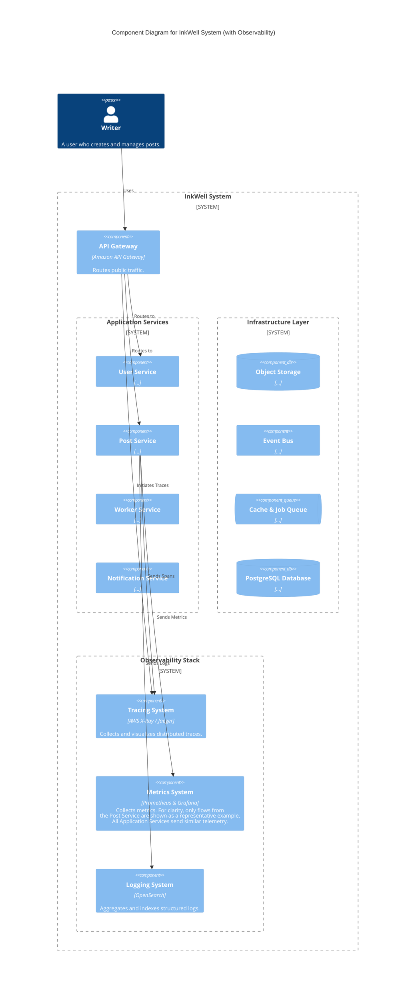
```mermaid
C4Component
    title Component Diagram for InkWell System (with Observability)

    Person(writer, "Writer", "A user who creates and manages posts.")

    System_Boundary(c1, "InkWell System") {
        Component(gateway, "API Gateway", "Amazon API Gateway", "Routes public traffic.")
        
        System_Boundary(c2, "Application Services") {
            Component(userService, "User Service", "...")
            Component(postService, "Post Service", "...")
            Component(workerService, "Worker Service", "...")
            Component(notificationService, "Notification Service", "...")
        }
        
        System_Boundary(c3, "Infrastructure Layer") {
             ComponentDb(storage, "Object Storage", "...")
             Component(eventBus, "Event Bus", "...")
             ComponentQueue(cacheQueue, "Cache & Job Queue", "...")
             ComponentDb(db, "PostgreSQL Database", "...")
        }

        System_Boundary(c4, "Observability Stack") {
            Component(tracing, "Tracing System", "AWS X-Ray / Jaeger", "Collects and visualizes distributed traces.")
            Component(metrics, "Metrics System", "Prometheus & Grafana", "Collects metrics. For clarity, only flows from<br/>the Post Service are shown as a representative example.<br/>All Application Services send similar telemetry.")
            Component(logging, "Logging System", "OpenSearch", "Aggregates and indexes structured logs.")
            
        }
    }

    %% Main Application Flows
    Rel(writer, gateway, "Uses")
    Rel(gateway, userService, "Routes to")
    Rel(gateway, postService, "Routes to")
    
    %% Observability Flow (Using Post Service as a representative example)
    Rel(postService, metrics, "Sends Metrics")
    Rel(postService, logging, "Sends Logs")
    Rel(postService, tracing, "Sends Spans")

    Rel(gateway, tracing, "Initiates Traces")
```

---

#### **Milestone 10: Harden Security and Externalize Configuration**

In the final step of our initial roadmap, we introduce a dedicated secret management system to complete our production-readiness posture.

*   **Key Architectural Changes:**
    *   A **Secret Store** component is added to the infrastructure layer.
    *   Following the "representative example" pattern, a relationship is shown from the **Post Service** to the **Secret Store**, representing that the service fetches its credentials at startup.
    *   The component's description clarifies that all application services follow this pattern, ensuring a secure and centrally-managed approach to secrets.

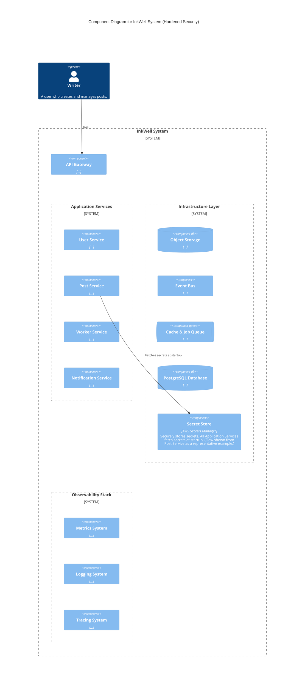
```mermaid
C4Component
    title Component Diagram for InkWell System (Hardened Security)

    Person(writer, "Writer", "A user who creates and manages posts.")

    System_Boundary(c1, "InkWell System") {
        Component(gateway, "API Gateway", "...")
        
        System_Boundary(c2, "Application Services") {
            Component(userService, "User Service", "...")
            Component(postService, "Post Service", "...")
            Component(workerService, "Worker Service", "...")
            Component(notificationService, "Notification Service", "...")
        }
        
        System_Boundary(c3, "Infrastructure Layer") {
             ComponentDb(storage, "Object Storage", "...")
             Component(eventBus, "Event Bus", "...")
             ComponentQueue(cacheQueue, "Cache & Job Queue", "...")
             ComponentDb(db, "PostgreSQL Database", "...")
             Component(secretStore, "Secret Store", "AWS Secrets Manager", "Securely stores secrets. All Application Services<br/>fetch secrets at startup. (Flow shown from<br/>Post Service as a representative example.)")
        }

        System_Boundary(c4, "Observability Stack") {
            Component(metrics, "Metrics System", "...")
            Component(logging, "Logging System", "...")
            Component(tracing, "Tracing System", "...")
        }
    }

    %% Main User Flow
    Rel(writer, gateway, "Uses")
    
    %% Secret Management Flow (Representative Example)
    Rel(postService, secretStore, "Fetches secrets at startup")
```

### Physical Architecture Evolution: The InkWell Platform on AWS

This document presents the physical deployment evolution of the InkWell platform on AWS. It illustrates how the logical components designed in the C4 model are implemented and deployed using concrete AWS services. The architecture progresses from a single, simple virtual machine to a comprehensive, distributed, and highly-available cloud-native system, with each diagram representing the physical state of the infrastructure after an architectural issue was addressed.

---

#### **Milestone 1: The Simplest Possible Thing (Co-located Containers)**

This is the initial physical deployment, designed for speed of development and simplicity. It co-locates all components on a single virtual server.

*   **Key Infrastructure Components & Topology:**
    *   A single **AWS EC2 Instance** is the sole piece of compute infrastructure.
    *   A **Docker** runtime is installed on the EC2 instance.
    *   Two containers run within Docker: the **InkWell API Container** and the **PostgreSQL Container**.
*   **Data Flow:**
    *   Traffic from the **Writer's Browser** on the internet connects directly to the EC2 instance.
    *   Inside the instance, the API container communicates with the database container via a local **TCP connection** over the Docker network.

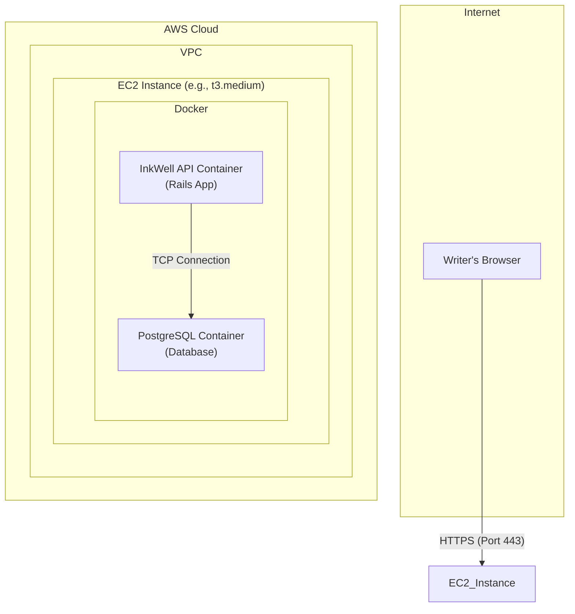
```mermaid
graph TD
    subgraph "Internet"
        User["Writer's Browser"]
    end

    subgraph "AWS Cloud"
        subgraph "VPC"
            subgraph "EC2 Instance (e.g., t3.medium)"
                direction LR
                subgraph "Docker"
                    api_container["InkWell API Container<br>(Rails App)"]
                    db_container["PostgreSQL Container<br>(Database)"]
                end
            end
        end
    end

    User -- "HTTPS (Port 443)" --> EC2_Instance
    api_container -- "TCP Connection" --> db_container
```

---

#### **Milestone 2: Production-Grade Persistence (Managed Database)**

This milestone makes the system's data layer robust and reliable by moving it to a managed service.

*   **Key Infrastructure Components & Topology:**
    *   The **PostgreSQL Container** is removed from the EC2 instance.
    *   A new, separate **Amazon RDS** service is provisioned within the VPC. This service is configured for high availability with a **Primary Instance** and a **Read Replica**.
*   **Data Flow:**
    *   The **InkWell API Container** now makes network calls across the VPC to the RDS service.
    *   A critical split in traffic is introduced: **SQL Writes** are directed to the RDS Primary, while **SQL Reads** are directed to the RDS Read Replica to scale the read workload.

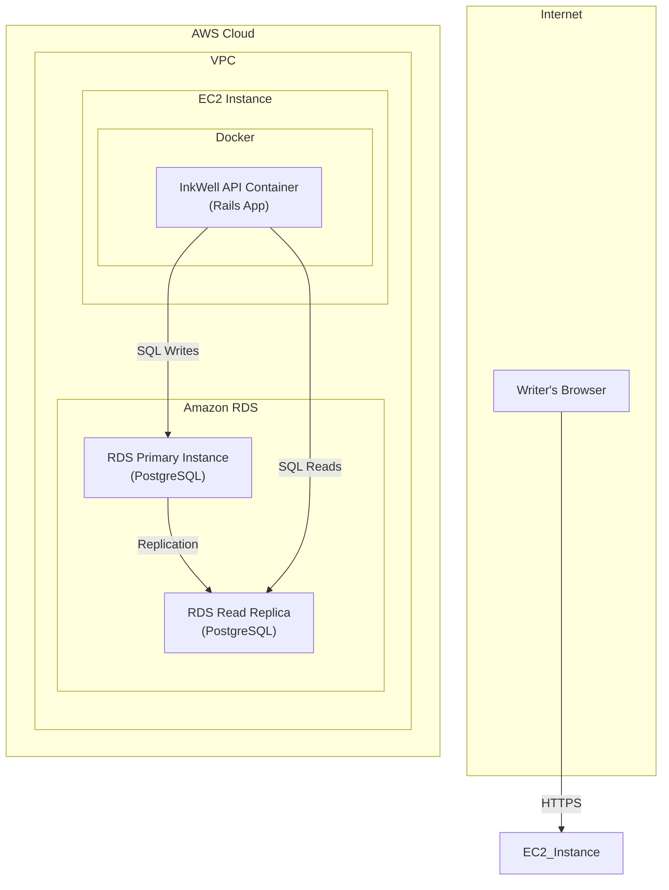
```mermaid
graph TD
    subgraph "Internet"
        User["Writer's Browser"]
    end

    subgraph "AWS Cloud"
        subgraph "VPC"
            subgraph "EC2 Instance"
                subgraph "Docker"
                    api_container["InkWell API Container<br>(Rails App)"]
                end
            end

            subgraph "Amazon RDS"
                direction LR
                db_primary["RDS Primary Instance<br>(PostgreSQL)"]
                db_replica["RDS Read Replica<br>(PostgreSQL)"]

                db_primary -- "Replication" --> db_replica
            end
        end
    end

    User -- "HTTPS" --> EC2_Instance
    api_container -- "SQL Writes" --> db_primary
    api_container -- "SQL Reads" --> db_replica
```

---

#### **Milestone 3: Secure Entry Point (API Gateway)**

The system's security posture is hardened by placing a managed API Gateway at the network edge.

*   **Key Infrastructure Components & Topology:**
    *   A new **Amazon API Gateway** is deployed as the public entry point.
    *   The **EC2 Instance** is moved to a conceptual **Private Subnet**, meaning it is no longer directly accessible from the public internet.
*   **Data Flow:**
    *   All HTTPS traffic from the **Writer's Browser** now terminates at the **API Gateway**.
    *   The API Gateway forwards valid requests over HTTPS to the **EC2 Instance**.

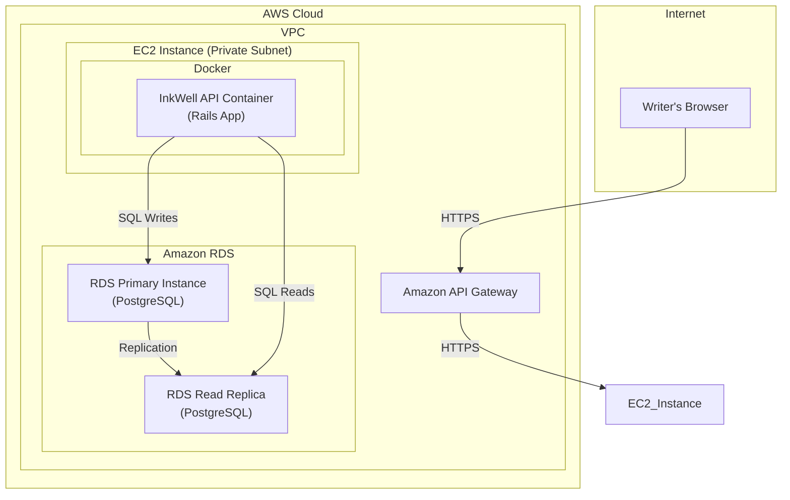
```mermaid
graph TD
    subgraph "Internet"
        User["Writer's Browser"]
    end

    subgraph "AWS Cloud"
        subgraph "VPC"
            subgraph "EC2 Instance (Private Subnet)"
                subgraph "Docker"
                    api_container["InkWell API Container<br>(Rails App)"]
                end
            end

            subgraph "Amazon RDS"
                direction LR
                db_primary["RDS Primary Instance<br>(PostgreSQL)"]
                db_replica["RDS Read Replica<br>(PostgreSQL)"]

                db_primary -- "Replication" --> db_replica
            end

            Gateway["Amazon API Gateway"]
        end
    end

    User -- "HTTPS" --> Gateway
    Gateway -- "HTTPS" --> EC2_Instance

    api_container -- "SQL Writes" --> db_primary
    api_container -- "SQL Reads" --> db_replica
```

---

#### **Milestone 4: First Decomposition (Co-located Microservices)**

The monolith is broken apart. For pragmatic reasons, the new service is initially co-located on the same physical host.

*   **Key Infrastructure Components & Topology:**
    *   A new **User Service Container** is added to the Docker environment on the *same* EC2 instance as the existing **Post Service Container**.
*   **Data Flow:**
    *   The **API Gateway** now performs path-based routing, sending requests for `/users/*` to the User Service container and `/posts/*` to the Post Service container.
    *   A new internal, east-west traffic path is created: the **Post Service Container** makes a direct **API Call (HTTP)** to the **User Service Container** over the local Docker network.

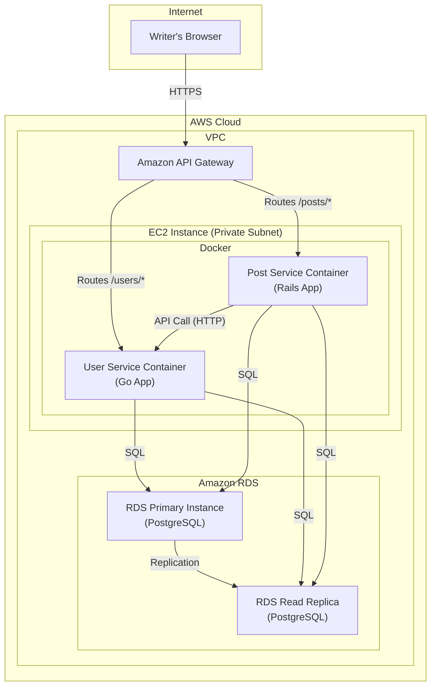
```mermaid
graph TD
    subgraph "Internet"
        User["Writer's Browser"]
    end

    subgraph "AWS Cloud"
        subgraph "VPC"
            subgraph "EC2 Instance (Private Subnet)"
                subgraph "Docker"
                    direction LR
                    post_container["Post Service Container<br>(Rails App)"]
                    user_container["User Service Container<br>(Go App)"]
                end
            end

            subgraph "Amazon RDS"
                direction LR
                db_primary["RDS Primary Instance<br>(PostgreSQL)"]
                db_replica["RDS Read Replica<br>(PostgreSQL)"]

                db_primary -- "Replication" --> db_replica
            end

            Gateway["Amazon API Gateway"]
        end
    end

    User -- "HTTPS" --> Gateway
    Gateway -- "Routes /posts/*" --> post_container
    Gateway -- "Routes /users/*" --> user_container
    
    post_container -- "API Call (HTTP)" --> user_container

    user_container -- "SQL" --> db_primary
    post_container -- "SQL" --> db_primary
    user_container -- "SQL" --> db_replica
    post_container -- "SQL" --> db_replica
```

---

#### **Milestone 5: Asynchronous Processing (Job Queue)**

A background job system is introduced to improve API responsiveness.

*   **Key Infrastructure Components & Topology:**
    *   A new managed service, **Amazon ElastiCache for Redis**, is deployed in the VPC to serve as the job queue.
    *   A new **Worker Service Container** is added to the Docker environment on the shared EC2 instance.
*   **Data Flow:**
    *   An asynchronous flow is created: the **Post Service Container** sends an `ENQUEUE` command to the **Redis Cluster**.
    *   Separately, the **Worker Service Container** sends a `DEQUEUE` command to the **Redis Cluster** to fetch jobs.
    *   The Worker then makes an `SQL Update` call to the **RDS Primary** to complete the job.

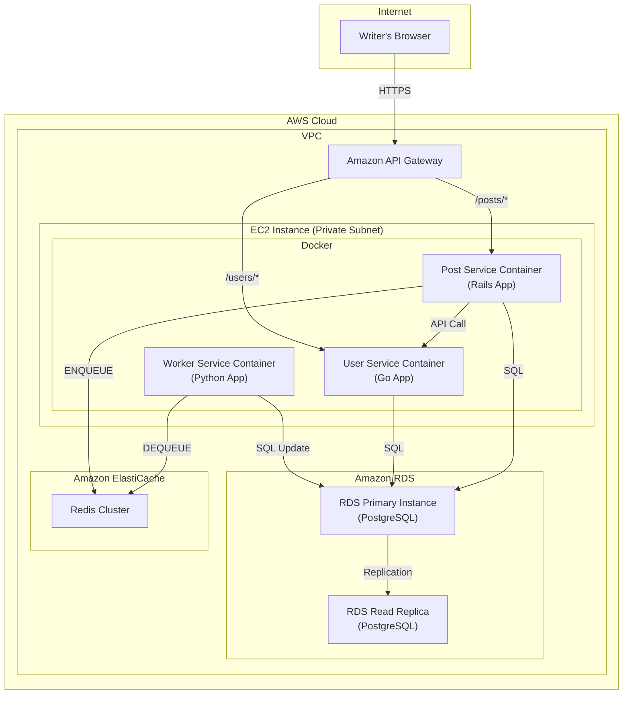
```mermaid
graph TD
    subgraph "Internet"
        User["Writer's Browser"]
    end

    subgraph "AWS Cloud"
        subgraph "VPC"
            subgraph "EC2 Instance (Private Subnet)"
                subgraph "Docker"
                    direction LR
                    post_container["Post Service Container<br>(Rails App)"]
                    user_container["User Service Container<br>(Go App)"]
                    worker_container["Worker Service Container<br>(Python App)"]
                end
            end

            subgraph "Amazon RDS"
                direction LR
                db_primary["RDS Primary Instance<br>(PostgreSQL)"]
                db_replica["RDS Read Replica<br>(PostgreSQL)"]
                db_primary -- "Replication" --> db_replica
            end
            
            subgraph "Amazon ElastiCache"
                redis["Redis Cluster"]
            end

            Gateway["Amazon API Gateway"]
        end
    end

    User -- "HTTPS" --> Gateway
    Gateway -- "/posts/*" --> post_container
    Gateway -- "/users/*" --> user_container
    
    post_container -- "API Call" --> user_container
    post_container -- "ENQUEUE" --> redis
    worker_container -- "DEQUEUE" --> redis
    
    worker_container -- "SQL Update" --> db_primary
    user_container -- "SQL" --> db_primary
    post_container -- "SQL" --> db_primary
```

---

#### **Milestone 6: Performance Optimization (Caching Layer)**

To reduce database load, the existing Redis cluster is repurposed to also serve as a high-speed cache.

*   **Key Infrastructure Components & Topology:**
    *   No new physical components are added in this milestone.
*   **Data Flow:**
    *   The read path for the **Post Service Container** becomes more sophisticated:
        1.  It first makes a **Cache Check** call to the **Redis Cluster**.
        2.  Only on a cache miss does it make a subsequent call to the **RDS Read Replica**.

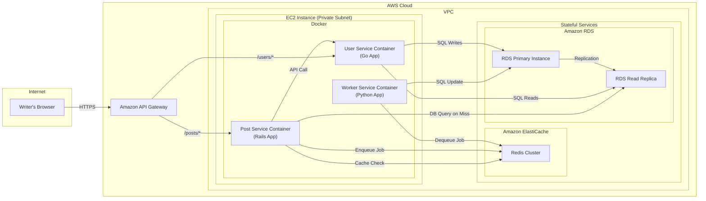
```mermaid
graph LR
    subgraph "Internet"
        User["Writer's Browser"]
    end

    subgraph "AWS Cloud"
        Gateway["Amazon API Gateway"]
        
        subgraph "VPC"
            subgraph "EC2 Instance (Private Subnet)"
                subgraph "Docker"
                    post_container["Post Service Container<br>(Rails App)"]
                    user_container["User Service Container<br>(Go App)"]
                    worker_container["Worker Service Container<br>(Python App)"]
                end
            end

            subgraph "Stateful Services"
                subgraph "Amazon ElastiCache"
                    redis["Redis Cluster"]
                end

                subgraph "Amazon RDS"
                    db_primary["RDS Primary Instance"]
                    db_replica["RDS Read Replica"]
                end
            end
        end
    end

    %% Define Flows
    User -- "HTTPS" --> Gateway
    Gateway -- "/posts/*" --> post_container
    Gateway -- "/users/*" --> user_container
    
    post_container -- "Cache Check" --> redis
    post_container -- "DB Query on Miss" --> db_replica
    
    post_container -- "API Call" --> user_container
    post_container -- "Enqueue Job" --> redis
    
    worker_container -- "Dequeue Job" --> redis
    worker_container -- "SQL Update" --> db_primary
    
    user_container -- "SQL Writes" --> db_primary
    user_container -- "SQL Reads" --> db_replica

    db_primary -- "Replication" --> db_replica
```

---

#### **Milestone 7: Decoupling with an Event Bus**

A true event-driven pattern is introduced for notifications, making the system more scalable and resilient.

*   **Key Infrastructure Components & Topology:**
    *   Two new serverless messaging services are introduced: an **Amazon SNS Topic** and an **Amazon SQS Queue**.
    *   A new **Notification Service Container** is added to the Docker environment on the shared EC2 instance.
*   **Data Flow:**
    *   A new, multi-step event flow is established:
        1.  The **Post Service Container** publishes an event to the **SNS Topic**.
        2.  SNS pushes the message to the subscribed **SQS Queue**.
        3.  The **Notification Service Container** polls the **SQS Queue** to receive and process the event.

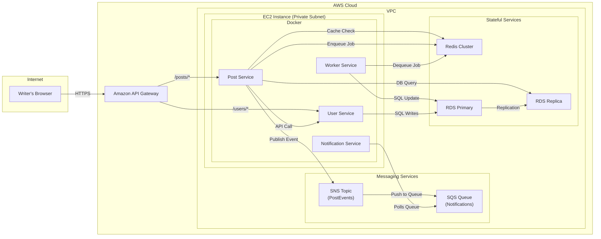
```mermaid
graph LR
    subgraph "Internet"
        User["Writer's Browser"]
    end

    subgraph "AWS Cloud"
        Gateway["Amazon API Gateway"]
        
        subgraph "VPC"
            subgraph "EC2 Instance (Private Subnet)"
                subgraph "Docker"
                    post_container["Post Service"]
                    user_container["User Service"]
                    worker_container["Worker Service"]
                    notification_container["Notification Service"]
                end
            end

            subgraph "Messaging Services"
                sns["SNS Topic<br>(PostEvents)"]
                sqs["SQS Queue<br>(Notifications)"]
            end

            subgraph "Stateful Services"
                redis["Redis Cluster"]
                db_primary["RDS Primary"]
                db_replica["RDS Replica"]
            end
        end
    end

    %% Define User-Facing Flows
    User -- "HTTPS" --> Gateway
    Gateway -- "/posts/*" --> post_container
    Gateway -- "/users/*" --> user_container
    
    %% Define Event-Driven Flow
    post_container -- "Publish Event" --> sns
    sns -- "Push to Queue" --> sqs
    notification_container -- "Polls Queue" --> sqs
    
    %% Define Other Internal Flows
    post_container -- "Cache Check" --> redis
    post_container -- "DB Query" --> db_replica
    post_container -- "API Call" --> user_container
    post_container -- "Enqueue Job" --> redis
    worker_container -- "Dequeue Job" --> redis
    worker_container -- "SQL Update" --> db_primary
    user_container -- "SQL Writes" --> db_primary
    db_primary -- "Replication" --> db_replica
```

---

#### **Milestone 8: Scalable Media Storage (Object Storage)**

A best-practice solution for handling large file uploads is implemented, offloading the work from application servers.

*   **Key Infrastructure Components & Topology:**
    *   A new, globally-available **Amazon S3 Bucket** is created for storing media.
*   **Data Flow:**
    *   The file upload flow is completely re-architected:
        1.  The **Writer's Browser** makes a request via the **API Gateway** to the **Post Service Container** to get a secure, pre-signed URL.
        2.  The Post Service returns the URL to the browser.
        3.  The browser then uploads the file **directly** to the **Amazon S3 Bucket**, bypassing the application's EC2 instance entirely.

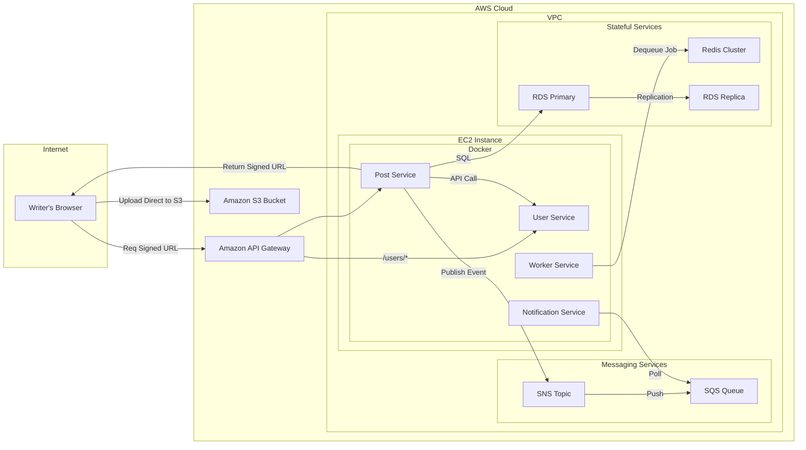
```mermaid
graph LR
    subgraph "Internet"
        User["Writer's Browser"]
    end

    subgraph "AWS Cloud"
        Gateway["Amazon API Gateway"]
        S3["Amazon S3 Bucket"]

        subgraph "VPC"
            subgraph "EC2 Instance"
                subgraph "Docker"
                    post_container["Post Service"]
                    user_container["User Service"]
                    worker_container["Worker Service"]
                    notification_container["Notification Service"]
                end
            end

            subgraph "Messaging Services"
                sns["SNS Topic"]
                sqs["SQS Queue"]
            end

            subgraph "Stateful Services"
                redis["Redis Cluster"]
                db_primary["RDS Primary"]
                db_replica["RDS Replica"]
            end
        end
    end

    %% Define Upload Flow
    User -- "Req Signed URL" --> Gateway
    Gateway -- " " --> post_container
    post_container -- "Return Signed URL" --> User
    User -- "Upload Direct to S3" --> S3

    %% Define Existing Flows
    Gateway -- "/users/*" --> user_container
    post_container -- "Publish Event" --> sns
    sns -- "Push" --> sqs
    notification_container -- "Poll" --> sqs
    post_container -- "API Call" --> user_container
    worker_container -- "Dequeue Job" --> redis
    post_container -- "SQL" --> db_primary
    db_primary -- "Replication" --> db_replica
```

---

#### **Milestone 9: Comprehensive Observability (Monitoring Stack)**

A dedicated stack is introduced to monitor, log, and trace the behavior of the distributed system.

*   **Key Infrastructure Components & Topology:**
    *   A new, dedicated **Monitoring EC2 Instance** is deployed to host resource-intensive tools like **Prometheus**, **Grafana**, and **OpenSearch**. This physically isolates the monitoring stack.
    *   A new **Log Shipper Container** (e.g., Fluentd) is added to the **App EC2 Instance**.
*   **Data Flow:**
    *   **Metrics:** Prometheus on the monitoring instance *pulls* data by scraping the `/metrics` endpoints of the app containers.
    *   **Logging:** The **Log Shipper** *pushes* logs to **OpenSearch** on the monitoring instance.
    *   **Tracing:** The app containers *push* trace data to a trace collector (e.g., Jaeger) on the monitoring instance.

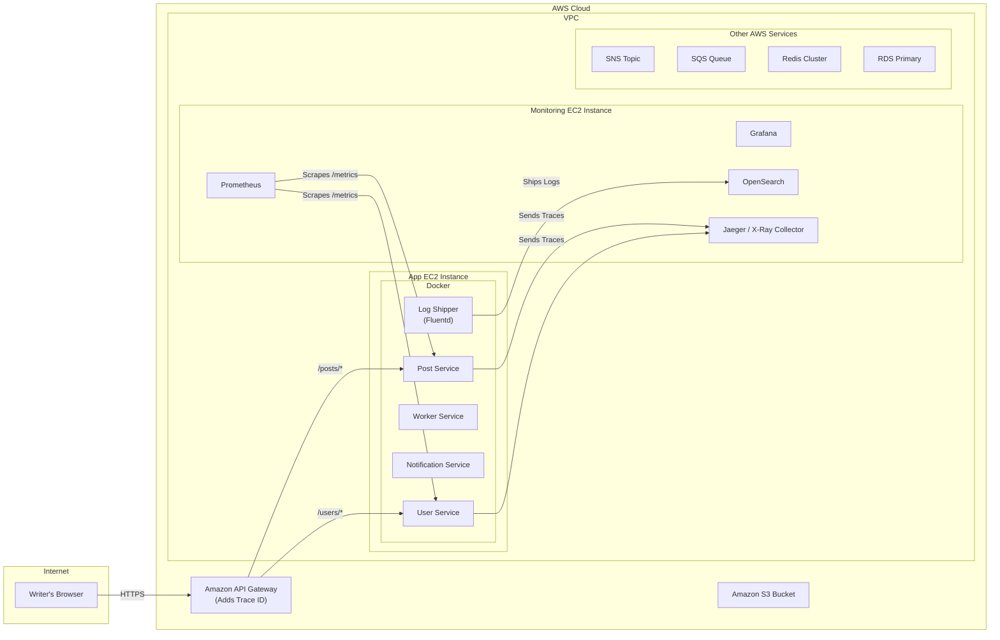
```mermaid
graph LR
    subgraph "Internet"
        User["Writer's Browser"]
    end

    subgraph "AWS Cloud"
        Gateway["Amazon API Gateway<br>(Adds Trace ID)"]
        S3["Amazon S3 Bucket"]

        subgraph "VPC"
            subgraph "App EC2 Instance"
                subgraph "Docker"
                    post_container["Post Service"]
                    user_container["User Service"]
                    worker_container["Worker Service"]
                    notification_container["Notification Service"]
                    log_shipper["Log Shipper<br>(Fluentd)"]
                end
            end

            subgraph "Monitoring EC2 Instance"
                prometheus["Prometheus"]
                grafana["Grafana"]
                opensearch["OpenSearch"]
                jaeger["Jaeger / X-Ray Collector"]
            end

            subgraph "Other AWS Services"
                %% Grouping existing services for clarity
                sns["SNS Topic"]
                sqs["SQS Queue"]
                redis["Redis Cluster"]
                db_primary["RDS Primary"]
            end
        end
    end

    %% Define Observability Flows
    prometheus -- "Scrapes /metrics" --> post_container
    prometheus -- "Scrapes /metrics" --> user_container
    log_shipper -- "Ships Logs" --> opensearch
    post_container -- "Sends Traces" --> jaeger
    user_container -- "Sends Traces" --> jaeger

    %% Define Main User Flow
    User -- "HTTPS" --> Gateway
    Gateway -- "/posts/*" --> post_container
    Gateway -- "/users/*" --> user_container
```

---

#### **Milestone 10: Hardened Security (Secret Management)**

The final production-readiness step is to implement a secure, centralized system for managing application secrets.

*   **Key Infrastructure Components & Topology:**
    *   A new global AWS service, **AWS Secrets Manager**, is introduced.
    *   An **EC2 Instance IAM Role** is created and attached to the **App EC2 Instance**. This role grants the instance (and the containers running on it) permission to access specific secrets.
*   **Data Flow:**
    *   A new startup flow is established for all application services: upon starting, each container uses the credentials provided by the **IAM Role** to make a secure API call to **AWS Secrets Manager** to fetch its database password and other secrets.

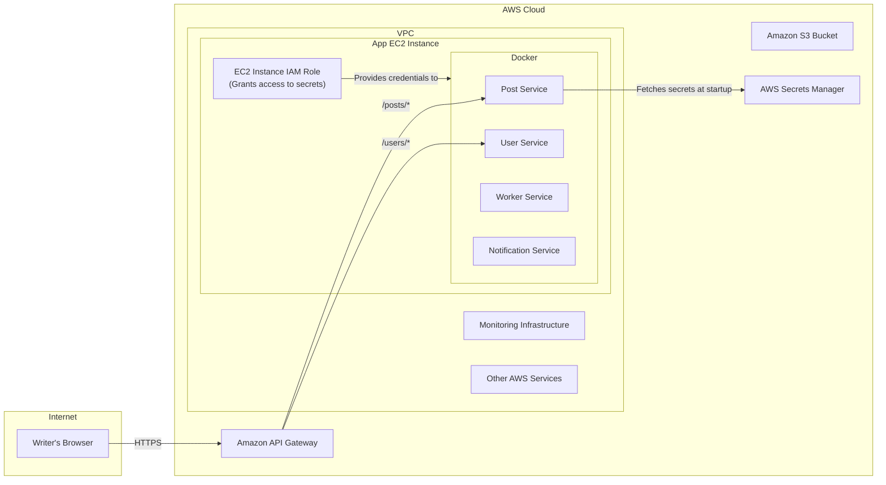
```mermaid
graph LR
    subgraph "Internet"
        User["Writer's Browser"]
    end

    subgraph "AWS Cloud"
        Gateway["Amazon API Gateway"]
        S3["Amazon S3 Bucket"]
        SecretsManager["AWS Secrets Manager"]

        subgraph "VPC"
            subgraph "App EC2 Instance"
                IAM_Role["EC2 Instance IAM Role<br>(Grants access to secrets)"]
                IAM_Role -- "Provides credentials to" --> Docker
                subgraph "Docker"
                    post_container["Post Service"]
                    user_container["User Service"]
                    worker_container["Worker Service"]
                    notification_container["Notification Service"]
                end
            end

            %% Other groups for clarity
            Monitoring["Monitoring Infrastructure"]
            AWSServices["Other AWS Services"]
        end
    end

    %% Define Secret Fetch Flow (using a representative example)
    post_container -- "Fetches secrets at startup" --> SecretsManager
    
    %% User Flow
    User -- "HTTPS" --> Gateway
    Gateway -- "/posts/*" --> post_container
    Gateway -- "/users/*" --> user_container
```
