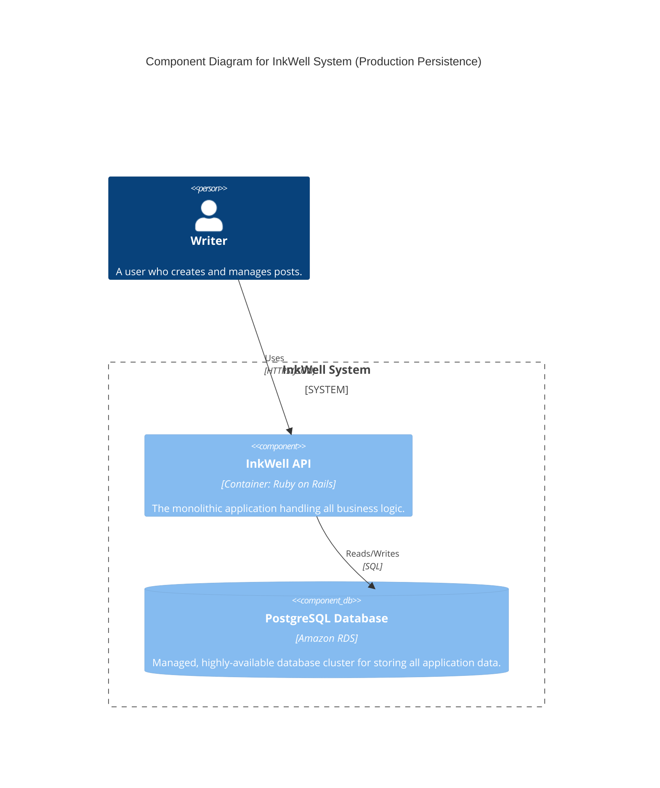
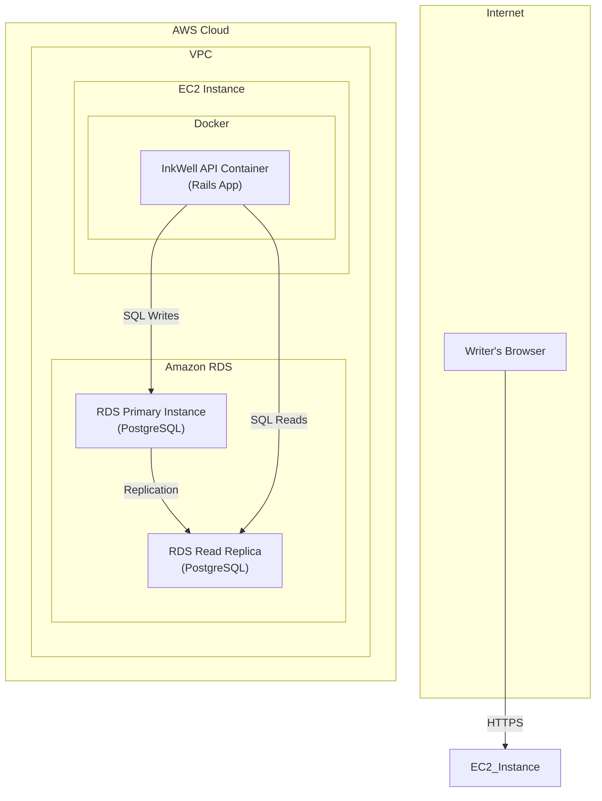

#### 1. Logical View (C4 Component Diagram)

The logical view remains very similar, as the fundamental components have not changed. However, we update the description of the database component to reflect its new nature as a managed, scalable entity.

#### 2. Physical View (AWS Deployment Diagram)

This diagram shows the most significant change. The database container is removed from the EC2 instance, and a new, managed RDS service is introduced within our cloud environment.

#### 3. Component-to-Resource Mapping Table

This table is updated to reflect the new physical resources and the rationale for this critical architectural evolution.

| Logical Component | Physical Resource | Rationale |
| :--- | :--- | :--- |
| **InkWell API** | `InkWell API Container` running on an AWS EC2 Instance. | (Unchanged) A containerized application provides a consistent runtime environment. Keeping it on a single EC2 instance is sufficient for this stage. |
| **PostgreSQL Database** | `Amazon RDS for PostgreSQL` with one Primary and one Read Replica instance. | **Reliability and Scalability:** Moving to a managed service like RDS offloads the critical tasks of database management (backups, patching, failover). Using a primary/replica setup is a standard pattern that provides high availability and allows us to scale read-heavy workloads independently of the write workload, protecting the primary instance's performance. |
