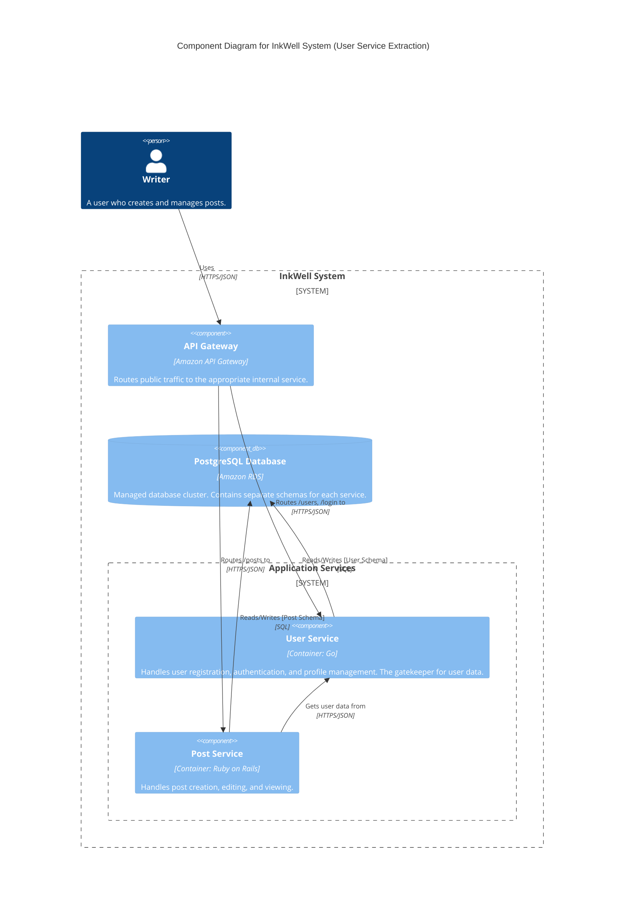
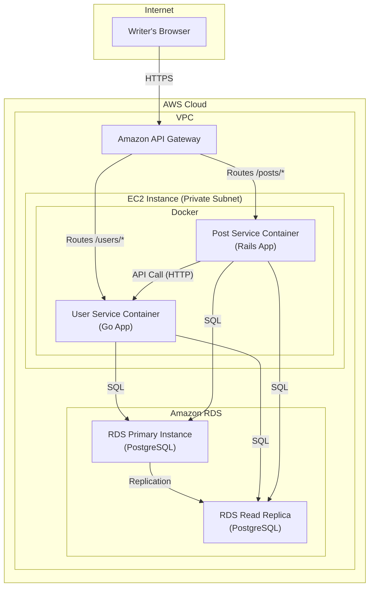

#### 1. Logical View (C4 Component Diagram)

This diagram visualizes the decomposition. We now have two distinct services behind the API Gateway, each with its own responsibilities.

#### 2. Physical View (AWS Deployment Diagram)

For this initial decomposition, we will run the new `user-service` container on the *same* EC2 instance as the `post-service` to manage cost and complexity. The API Gateway is now responsible for routing to the correct container port.

#### 3. Component-to-Resource Mapping Table

We add the new `User Service` component and update the roles of the existing components.

| Logical Component | Physical Resource | Rationale |
| :--- | :--- | :--- |
| **API Gateway** | `Amazon API Gateway` | (Updated Rationale) Now performs L7 routing, directing traffic to different backend services based on the request path (e.g., `/users` vs `/posts`). |
| **User Service** | `User Service Container` running on the shared AWS EC2 instance. | **State Encapsulation:** This new service owns all logic and data related to users. Running it on the same instance as the post service is a cost-effective intermediate step before migrating to a full container orchestration platform. |
| **Post Service** (formerly InkWell API) | `Post Service Container` running on the shared AWS EC2 instance. | **Domain Focus:** This service is now leaner, focusing solely on post management. It delegates all user-related concerns to the `User Service`. |
| **PostgreSQL Database** | `Amazon RDS for PostgreSQL` | (Updated Rationale) The single database cluster now serves multiple services. Access should be logically partitioned (e.g., using separate schemas and database users) to enforce boundaries and the principle of least privilege. |
