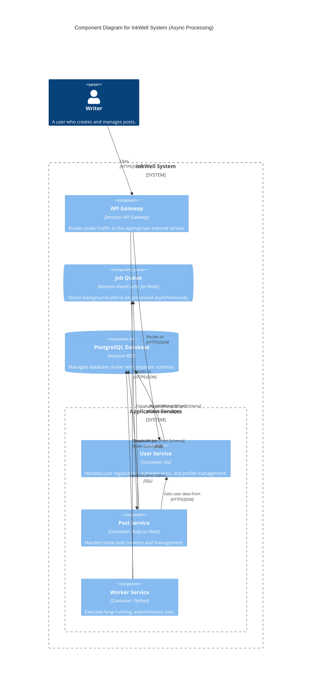
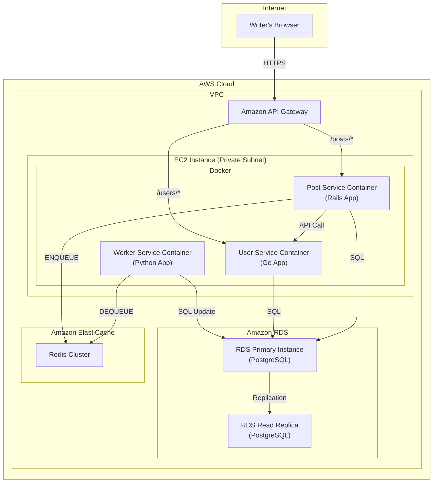

#### 1. Logical View (C4 Component Diagram)

This diagram adds the new `Job Queue` and `Worker Service` and shows how they interact with the existing `Post Service`.

#### 2. Physical View (AWS Deployment Diagram)

We will add the new `worker-service` container to our existing EC2 instance and introduce a new managed `Amazon ElastiCache` service for the Redis queue.

#### 3. Component-to-Resource Mapping Table

We add the new components for the queue and the worker.

| Logical Component | Physical Resource | Rationale |
| :--- | :--- | :--- |
| **API Gateway** | `Amazon API Gateway` | (Unchanged) Routes traffic to synchronous, user-facing services. |
| **User Service** | `User Service Container` | (Unchanged) Manages user data. |
| **Post Service** | `Post Service Container` | (Updated Rationale) Now offloads slow operations by enqueuing jobs into Redis, resulting in faster API responses. |
| **Job Queue** | `Amazon ElastiCache for Redis` | **Reliability and Simplicity:** Using a managed service for our queue (a stateful component) offloads the operational burden of managing a reliable Redis cluster. It's a proven, high-performance choice for background job queues. |
| **Worker Service** | `Worker Service Container` running on the shared EC2 instance. | **Stateless Scalability:** This is a stateless processing component. For now, running it on the shared EC2 instance is the most cost-effective solution. In the future, this is a prime candidate to be moved to a serverless or auto-scaling container platform. |
| **PostgreSQL Database** | `Amazon RDS for PostgreSQL` | (Unchanged) The source of truth for all core data. |
