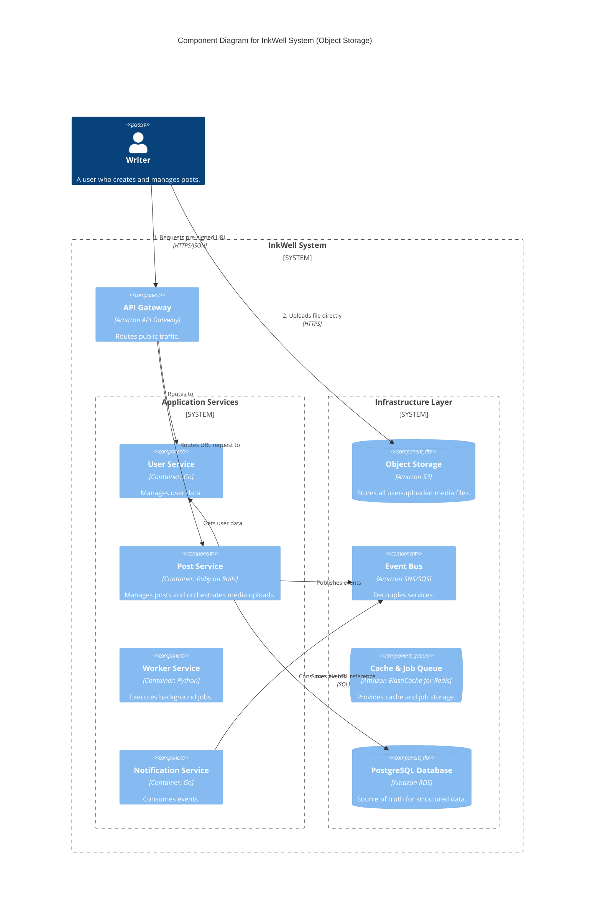
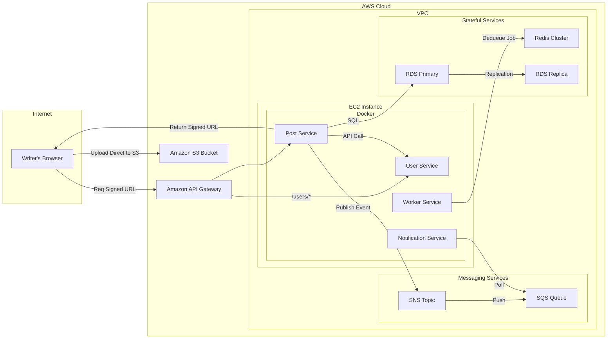

#### 1. Logical View (C4 Component Diagram)

This diagram introduces a new "Object Storage" component. Crucially, it shows the `Writer` interacting directly with it for the upload, which is a key part of the new design.

#### 2. Physical View (AWS Deployment Diagram)

The physical diagram adds the new `Amazon S3 Bucket` and clearly visualizes the new two-part upload flow.

#### 3. Component-to-Resource Mapping Table

We add the new object storage component.

| Logical Component | Physical Resource | Rationale |
| :--- | :--- | :--- |
| **Object Storage** | `Amazon S3 Bucket` | **Scalability, Durability, and Performance:** S3 is the industry standard for object storage, offering virtually limitless scalability and extreme durability. The pre-signed URL pattern offloads the bandwidth and processing of file uploads from our application servers, which is critical for performance and cost-effectiveness. |
| **Post Service** | `Post Service Container` | (Updated Rationale) Its role in uploads is now orchestration: it validates the request, generates a secure, short-lived upload URL via the AWS SDK, and saves the final file location to the database. It no longer processes the file contents directly. |
| ...(Other components unchanged)... | ... | ... |
