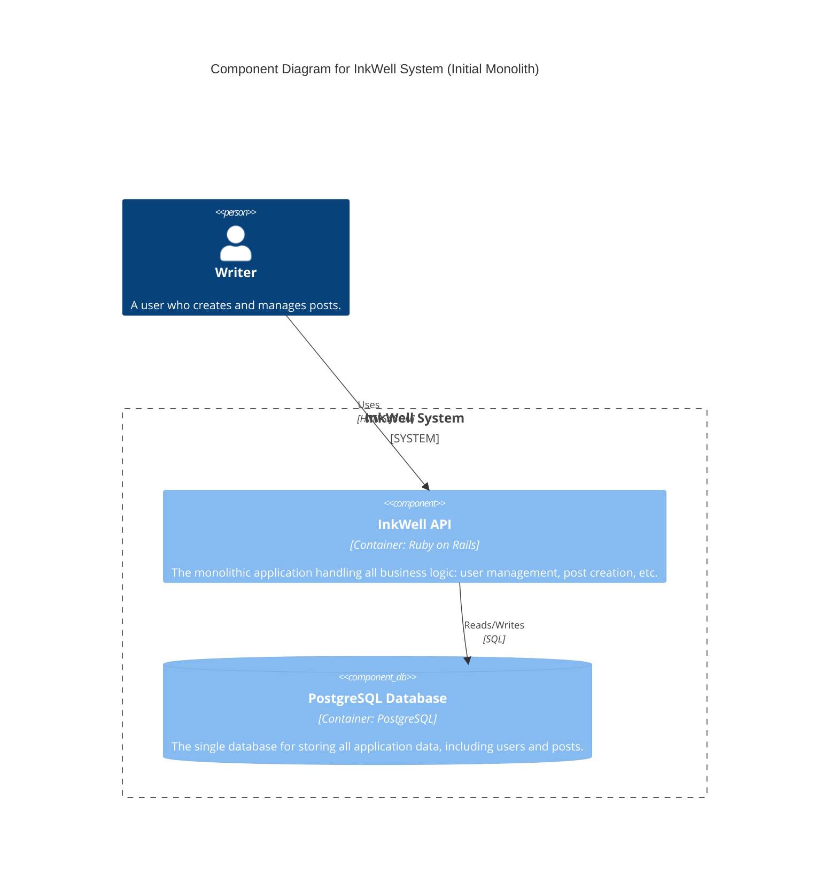
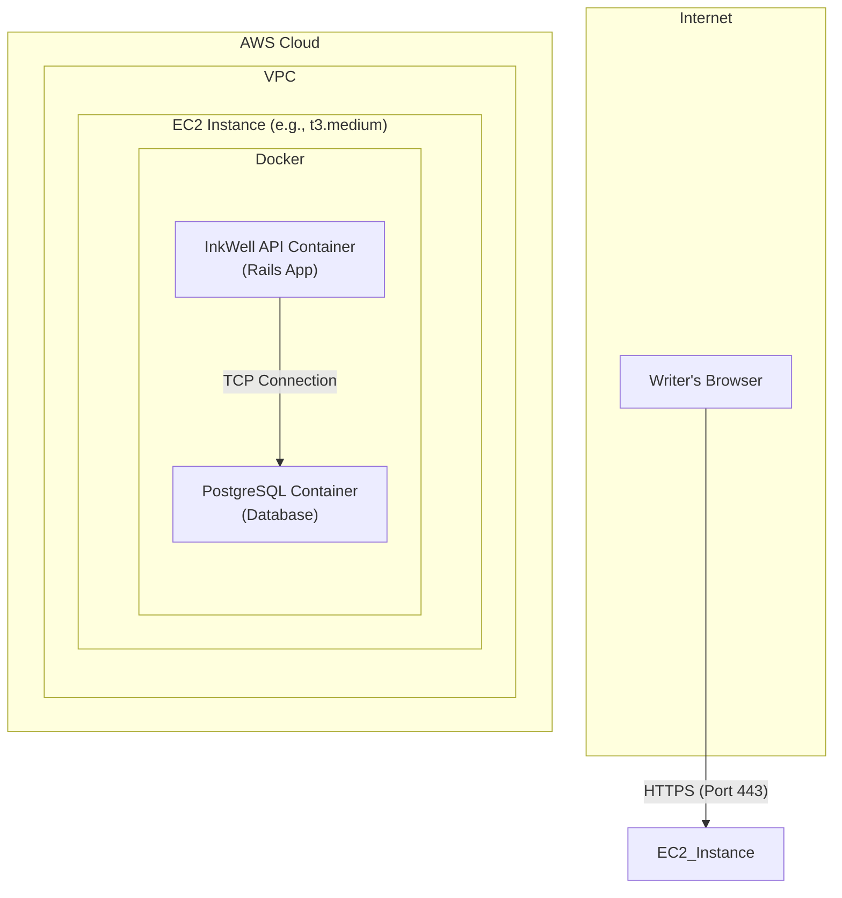

#### 1. Logical View (C4 Component Diagram)

This diagram describes the logical building blocks of the system and their interactions, answering the question: "What are the components and how do they relate?"

#### 2. Physical View (AWS Deployment Diagram)

This diagram maps the logical components to specific technologies and infrastructure, answering the question: "Where does each component physically run?"

#### 3. Component-to-Resource Mapping Table

This table explicitly links the logical components to their physical counterparts and provides the justification for each choice.

| Logical Component | Physical Resource | Rationale |
| :--- | :--- | :--- |
| **InkWell API** | `InkWell API Container` running on a single AWS EC2 Instance. | **Simplicity and Speed:** For this initial stage, co-locating the application and database containers on a single virtual server is the fastest and simplest way to create a working end-to-end environment. It minimizes infrastructure overhead and configuration complexity. |
| **PostgreSQL Database** | `PostgreSQL Container` running on the same AWS EC2 Instance. | **Development Parity:** Running the database as a container allows for easy local development and testing. It avoids the immediate cost and complexity of a managed database service, which is not necessary for this initial, non-production phase. |
