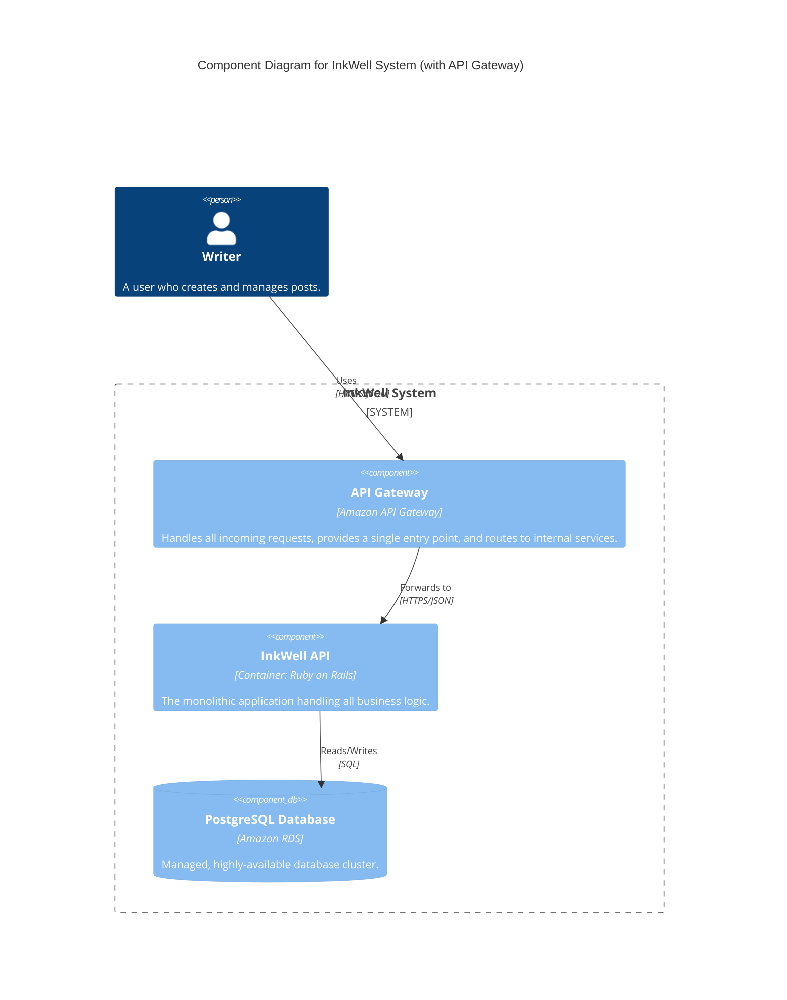
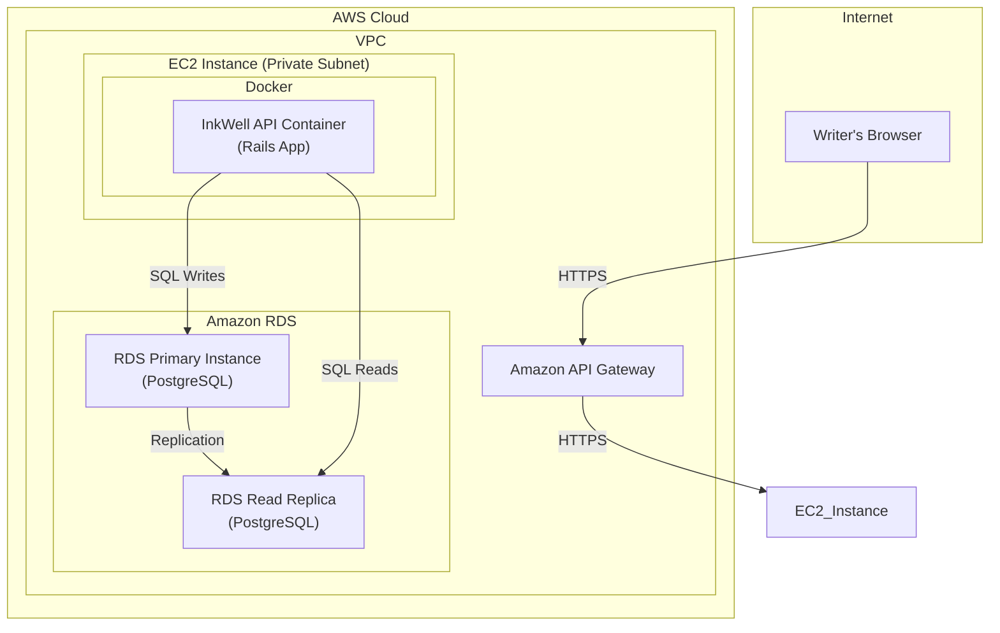

#### 1. Logical View (C4 Component Diagram)

In the logical view, the API Gateway is introduced as the new "front door" component to the system. It's the primary interface through which the user interacts with our services.

#### 2. Physical View (AWS Deployment Diagram)

The physical diagram clearly shows the new data flow. Traffic from the user now hits the API Gateway first, which then forwards the request to the previously-exposed EC2 instance.

#### 3. Component-to-Resource Mapping Table

We add the new API Gateway component and update the rationale for the InkWell API, which is no longer public-facing.

| Logical Component | Physical Resource | Rationale |
| :--- | :--- | :--- |
| **API Gateway** | `Amazon API Gateway` | **Security and Management:** A managed gateway is the best practice for exposing services. It provides a secure, scalable, and manageable front door, abstracting our internal services and providing a central point for policy enforcement. |
| **InkWell API** | `InkWell API Container` running on an AWS EC2 Instance in a **private subnet**. | (Updated Rationale) The service container no longer needs to be exposed to the public internet. By placing it in a private subnet, its attack surface is minimized. It now only needs to accept traffic from the trusted API Gateway. |
| **PostgreSQL Database** | `Amazon RDS for PostgreSQL` with one Primary and one Read Replica instance. | (Unchanged) A managed, highly-available database is the reliable foundation for our data persistence. |
