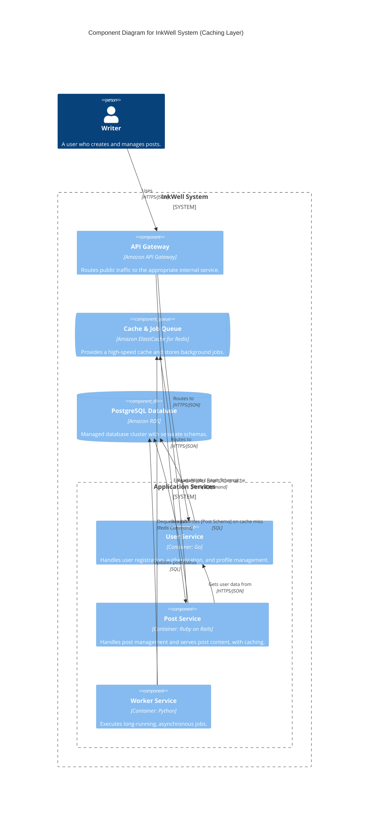
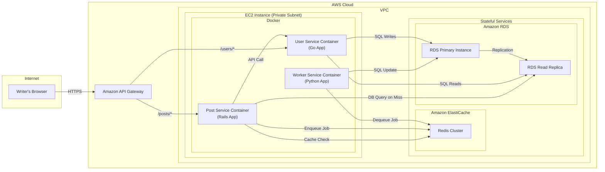

#### 1. Logical View (C4 Component Diagram)

We will update the description of the Redis component and add a new relationship from the `Post Service` to it, representing the cache read operation.

#### 2. Physical View (AWS Deployment Diagram)

The physical infrastructure doesn't change, but the data flow becomes more sophisticated. We add new arrows to represent the cache check and the subsequent database query on a cache miss.

#### 3. Component-to-Resource Mapping Table

We update the name and rationale for the Redis component and the `Post Service`.

| Logical Component | Physical Resource | Rationale |
| :--- | :--- | :--- |
| **API Gateway** | `Amazon API Gateway` | (Unchanged) Routes traffic to synchronous, user-facing services. |
| **User Service** | `User Service Container` | (Unchanged) Manages user data. |
| **Post Service** | `Post Service Container` | (Updated Rationale) Implements a read-through cache to reduce database load and improve latency for frequent reads. |
| **Cache & Job Queue** | `Amazon ElastiCache for Redis` | (Updated Rationale) This managed service now serves two critical roles: a high-performance, in-memory cache for hot data and a reliable queue for background jobs. Using a single Redis cluster for both is cost-effective at this stage. |
| **Worker Service** | `Worker Service Container` | (Unchanged) Stateless component for asynchronous processing. |
| **PostgreSQL Database**| `Amazon RDS for PostgreSQL` | (Unchanged) The source of truth for all core data. Its load is now protected by the caching layer. |
