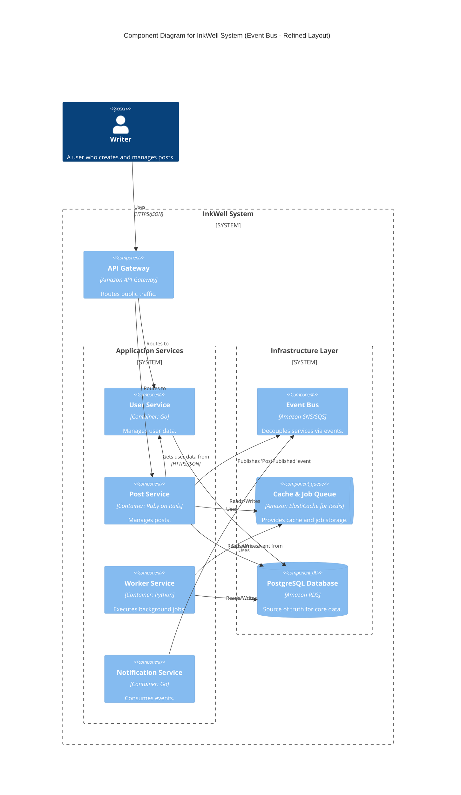
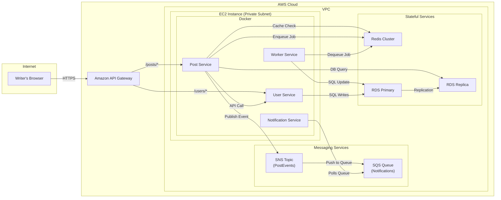

#### 1. Logical View (C4 Component Diagram)

This diagram adds the `Event Bus` as a central messaging component and the new `Notification Service` as a consumer.

#### 2. Physical View (AWS Deployment Diagram)

The physical diagram adds the new `Amazon SNS` and `SQS` services and the new `notification_container`.

#### 3. Component-to-Resource Mapping Table

We add the new components for the event bus and notification service.

| Logical Component | Physical Resource | Rationale |
| :--- | :--- | :--- |
| **API Gateway** | `Amazon API Gateway` | (Unchanged) System entry point. |
| **User Service** | `User Service Container` | (Unchanged) Manages user data. |
| **Post Service** | `Post Service Container` | (Updated Rationale) Now fully decoupled from downstream concerns like notifications by publishing events to SNS. |
| **Event Bus** | `Amazon SNS Topic` & `Amazon SQS Queue` | **Scalability & Resilience:** Using a managed pub/sub system (SNS) with durable queues (SQS) is a robust, highly scalable, and serverless pattern for event-driven architectures. It guarantees event delivery and allows consumers to process events at their own pace. |
| **Notification Service** | `Notification Service Container` | **Decoupled Consumer:** A new, single-purpose service that reacts to business events. Deploying it on the shared EC2 instance is a cost-effective initial step. |
| **Cache & Job Queue**| `Amazon ElastiCache for Redis` | (Unchanged) High-performance cache and job queue. |
| **Worker Service** | `Worker Service Container` | (Unchanged) Asynchronous job processor. |
| **PostgreSQL Database**| `Amazon RDS for PostgreSQL` | (Unchanged) The system's source of truth. |
