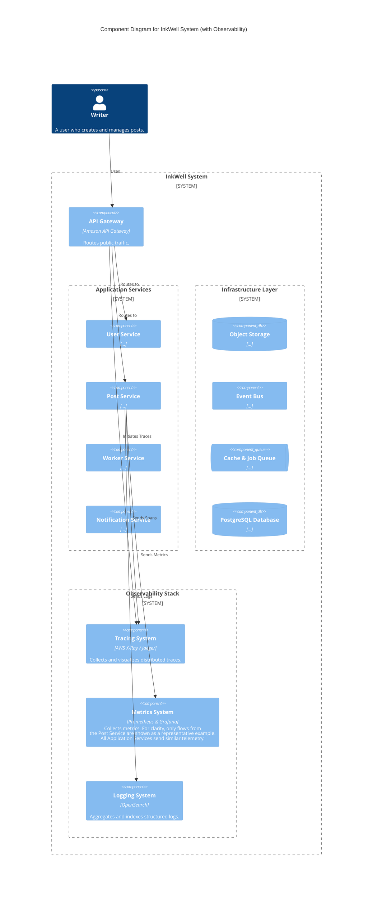
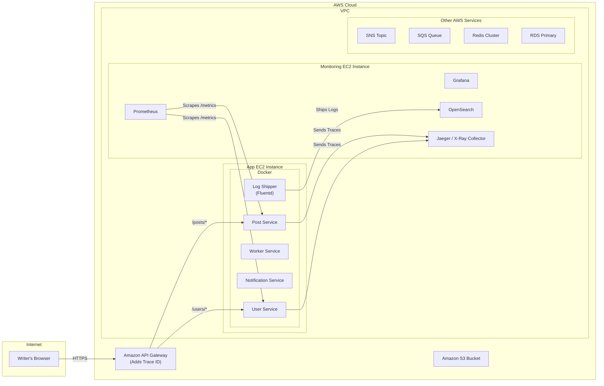

#### 1. Logical View (C4 Component Diagram)

This diagram introduces the observability stack as a separate logical block that supports all our application services.

#### 2. Physical View (AWS Deployment Diagram)

The physical diagram adds a new "Monitoring" instance and a log-shipping agent to our application instance.

#### 3. Component-to-Resource Mapping Table

We add the new logical components for the observability stack.

| Logical Component | Physical Resource | Rationale |
| :--- | :--- | :--- |
| **Metrics System** | `Prometheus` for collection, `Grafana` for dashboards, running on a dedicated Monitoring EC2 instance. | **Industry Standard:** Prometheus is the de-facto standard for metrics collection in cloud-native systems. A dedicated instance isolates the resource consumption of the monitoring stack from the application stack. |
| **Logging System** | `Fluentd` as a log shipping agent on the app instance, sending logs to a managed `Amazon OpenSearch` cluster. | **Decoupled and Scalable:** Using an agent like Fluentd decouples log shipping from the application logic. A managed OpenSearch cluster provides a powerful and scalable solution for searching and analyzing high volumes of log data without operational overhead. |
| **Tracing System** | `AWS X-Ray` or a self-hosted `Jaeger` collector. | **End-to-End Visibility:** Distributed tracing is the only way to effectively debug and analyze the performance of a request as it flows through multiple services, queues, and events. |
| ...(Other components unchanged)... | ... | ... |
