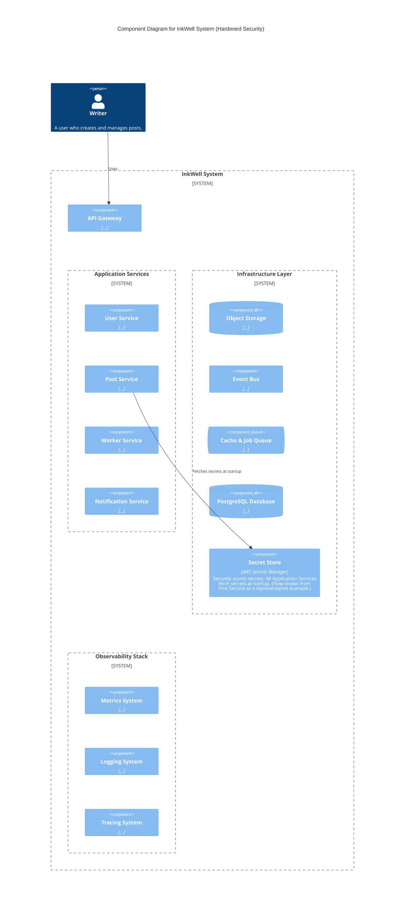
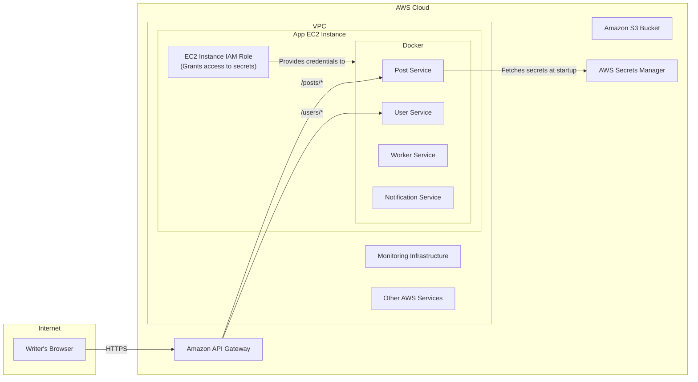

#### 1. Logical View (C4 Component Diagram)

This diagram introduces the new `Secret Store` as a critical infrastructure component that all services depend on.

#### 2. Physical View (AWS Deployment Diagram)

The physical diagram adds the new `AWS Secrets Manager` service and shows how services interact with it via IAM roles.

#### 3. Component-to-Resource Mapping Table

We add the final component, the `Secret Store`.

| Logical Component | Physical Resource | Rationale |
| :--- | :--- | :--- |
| **Secret Store** | `AWS Secrets Manager` or `HashiCorp Vault` | **Security Best Practice:** A dedicated, managed secret store is the industry standard for handling sensitive information. It provides fine-grained access control via IAM, automated secret rotation, and robust audit logging. This is a non-negotiable component for a secure, production-grade system. |
| **Application Services** | (All service containers) | **(Updated Rationale)** Services are now configured via a combination of environment variables (for non-secrets) and secrets fetched at runtime from the Secret Store (for credentials). This creates a clean, secure, and operationally flexible 12-Factor App design. |
| ...(Other components unchanged)... | ... | ... |
